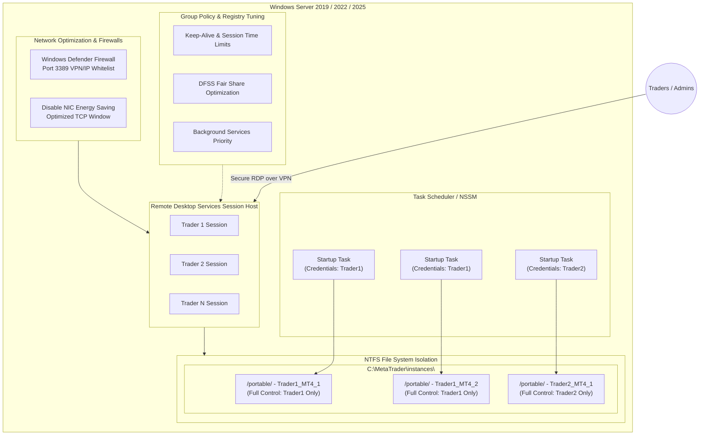

# Windows Server Multi-User Concurrent MetaTrader Architecture

This repository serves as the complete architectural reference and step-by-step implementation guide for configuring a high-availability, multi-user, and multi-session Windows Server environment optimized for running concurrent instances of **MetaTrader 4 (MT4)** and **MetaTrader 5 (MT5)**.

This setup is ideal for prop firms, trading groups, and quantitative asset managers who require multiple isolated traders or automated trading systems (EAs) to run concurrently on a single robust server without interference, resource starvation, or security cross-contamination.

---

## Project Overview

This repository provides comprehensive, production-grade documentation to set up, configure, and maintain a multi-user Windows Server environment from scratch to a fully operational production state. 

The architecture guarantees a secure, isolated, and highly optimized environment for concurrent remote users, characterized by:

*   **Concurrent Desktop Access:** Support for multiple concurrent user connections via Remote Desktop Protocol (RDP). Each user connects to their own isolated desktop environment simultaneously, ensuring zero conflicts, collisions, or session overlaps.
*   **Automated User & App Provisioning:** Automated user management, permission boundary creation, and portable application installations to eliminate manual setup tasks and guarantee configuration consistency.
*   **Granular Resource & Directory Isolation:** Each user operates within their own isolated context, mapping to secure `"Users"` directories. They have access to specific allocated resources and platforms while being strictly prevented from accessing other users' files, logs, or processes.
*   **Production-Ready Tuning:** Complete reference guides for GPO adjustments, registry optimization, Network Interface Card (NIC) performance, anti-malware exclusions, and automatic autostart boot tasks to ensure uninterrupted 24/7 background operation.

---

## Architectural Overview

Below is the conceptual architecture of the multi-user concurrent MetaTrader environment. It isolates each trader inside their own RDP session, leverages Windows Server Remote Desktop Session Host (RDSH), enforces strict NTFS-level isolation, and ensures high availability via automated startup scheduling.



---

## Table of Contents

1. [Hardware & Sizing Guide](#1-hardware--sizing-guide)
2. [Phase 0: AWS EC2 Windows Server Provisioning (Development)](#phase-0-aws-ec2-windows-server-provisioning-development)
3. [Phase 2: Remote Connection & Elevated Command Access](#phase-2-remote-connection--elevated-command-access)
4. [Phase 3: Scoped User Provisioning & Group Allocation](#phase-3-scoped-user-provisioning--group-allocation)

---

## 1. Hardware & Sizing Guide

Before deploying the architecture, size the hardware based on the cumulative load of all concurrent users and their respective EAs:

*   **Memory (RAM) Guidelines:**
    *   **Base OS Overhead:** 2.5 GB to 4 GB.
    *   **MetaTrader 4 (MT4) Instance:** ~150 MB to 300 MB per terminal (varies based on chart count, history size, and EA complexity).
    *   **MetaTrader 5 (MT5) Instance:** ~250 MB to 500 MB per terminal.
    *   *Formula:* `Required RAM = Base OS + (Number of Instances * Average Instance RAM) + Buffer (15%)`
*   **Processor (CPU) Guidelines:**
    *   Avoid using low-power CPU cores. High single-core speed is critical for fast order execution and EA processing.
    *   Allocate **1 physical core (or 2 vCPUs)** for every **3 to 5 active MetaTrader terminals** running normal EAs.
    *   Allocate **1 physical core** for every **1 to 2 active terminals** performing heavy optimization or high-frequency grid trading.
*   **Storage (SSD/NVMe):**
    *   **Mandatory:** Use Enterprise-grade NVMe SSDs in a RAID-1 or RAID-10 array. Standard HDDs or slow cloud block storage will bottleneck disk I/O when writing log files, tick histories, and indicators across multiple concurrent users.

---

## Phase 0: AWS EC2 Windows Server Provisioning (Development)

For development and testing environments supporting a maximum of **5 concurrent MetaTrader terminals**, a small, cost-effective EC2 instance is highly recommended to minimize operational costs while satisfying all architectural requirements.

### Development Sizing Configuration
*   **Instance Type:** `t3.medium` (2 vCPUs, 4 GB RAM). This is sufficient for development purposes running up to 5 lightweight MetaTrader terminals under lean OS configurations.
*   **Storage:** 40 GB `gp3` SSD (EBS volume). Fast, high-IOPS storage is critical for concurrent log writes.
*   **Operating System:** Windows Server 2022 English Full Base (`ami-0909cee4864578472`).

Below is the automated step-by-step deployment using the AWS CLI under the `--profile julio` profile.

### Step 1: Provisioning the AWS Environment via AWS CLI

Run the following commands locally to prepare the security groups, SSH key pairs, and launch the development instance:

1.  **Retrieve the Latest Windows Server 2022 AMI:**
    Identify the latest Windows Server 2022 English Full Base AMI in your region (default: `us-east-1`):
    ```bash
    aws ec2 describe-images \
        --profile julio \
        --owners amazon \
        --filters "Name=name,Values=Windows_Server-2022-English-Full-Base-*" "Name=state,Values=available" \
        --query "sort_by(Images, &CreationDate)[-1].ImageId" \
        --output text
    # Output: ami-0909cee4864578472
    ```

2.  **Create a Dedicated Key Pair:**
    Generate an EC2 Key Pair named `mt-dev-key` and securely download the private `.pem` key:
    ```bash
    aws ec2 create-key-pair \
        --profile julio \
        --key-name mt-dev-key \
        --query "KeyMaterial" \
        --output text > mt-dev-key.pem

    # Restrict permissions on the private key file
    chmod 400 mt-dev-key.pem
    ```

3.  **Create a Secure Security Group:**
    Create a new security group named `mt-dev-sg` within your default VPC (e.g., `vpc-0bc96c10cb1e9608c`):
    ```bash
    aws ec2 create-security-group \
        --profile julio \
        --group-name mt-dev-sg \
        --description "Security group for MetaTrader Dev Server" \
        --vpc-id vpc-0bc96c10cb1e9608c \
        --query "GroupId" \
        --output text
    # Output: sg-0e8caf65de1b6c8c6
    ```

4.  **Lock Down Inbound Remote Desktop (RDP) Traffic:**
    Authorize port 3389 (RDP) only from your specific management public IP address (e.g., `38.252.111.234/32`) to prevent public exposure:
    ```bash
    aws ec2 authorize-security-group-ingress \
        --profile julio \
        --group-id sg-0e8caf65de1b6c8c6 \
        --protocol tcp \
        --port 3389 \
        --cidr 38.252.111.234/32
    ```

5.  **Launch the EC2 Development Instance:**
    Spin up the `t3.medium` instance using the parameters established above:
    ```bash
    aws ec2 run-instances \
        --profile julio \
        --image-id ami-0909cee4864578472 \
        --count 1 \
        --instance-type t3.medium \
        --key-name mt-dev-key \
        --security-group-ids sg-0e8caf65de1b6c8c6 \
        --associate-public-ip-address \
        --block-device-mappings '[{"DeviceName":"/dev/sda1","Ebs":{"VolumeSize":40,"VolumeType":"gp3"}}]' \
        --tag-specifications 'ResourceType=instance,Tags=[{Key=Name,Value=MT-SRV-DEV-01}]' \
        --query "Instances[0].InstanceId" \
        --output text
    # Output: i-0abcf66cf0d99f8c1
    ```

6.  **Retrieve Instance Public IP:**
    Query the public IP address of the newly provisioned development instance:
    ```bash
    aws ec2 describe-instances \
        --profile julio \
        --instance-ids i-0abcf66cf0d99f8c1 \
        --query "Reservations[0].Instances[0].PublicIpAddress" \
        --output text
    # Output: 44.203.211.14
    ```

7.  **Decrypt the Windows Administrator Password:**
    After waiting 3-4 minutes for Windows to initialize, decrypt the password using your local private key:
    ```bash
    aws ec2 get-password-data \
        --profile julio \
        --instance-id i-0abcf66cf0d99f8c1 \
        --priv-launch-key mt-dev-key.pem
    ```

---

## Phase 2: Remote Connection & Elevated Command Access

Once the AWS EC2 instance is fully initialized and you have retrieved the Administrator password, you must establish a Remote Desktop connection and open an elevated Administrative Command Prompt (CMD) to configure the system.

### Step 1: Connecting via Remote Desktop Protocol (RDP)

1.  **Launch your RDP Client:**
    *   *Windows:* Open **Remote Desktop Connection** (`mstsc`).
    *   *macOS:* Use **Microsoft Remote Desktop** from the App Store.
    *   *Linux:* Use **Remmina** or **xfreerdp**.
2.  **Enter Connection Details:**
    *   **Computer / Host IP:** `44.203.211.14` (your instance's public IP from Phase 0).
    *   **Username:** `Administrator`
3.  **Provide Credentials:**
    *   Input the decrypted password retrieved from the `aws ec2 get-password-data` command in Phase 0.
4.  **Accept Security Certificate:**
    *   Acknowledge the self-signed certificate warning to establish the secure session.

### Step 2: Launching Command Prompt (CMD) with Admin Privileges

Many setup operations require absolute system privileges. You must run all command shells in **Elevated Mode**:

1.  Inside the Remote Desktop session, click the **Start Menu** or press `Win + S`.
2.  Type `cmd` in the search bar.
3.  Right-click **Command Prompt** and select **Run as administrator**.
4.  If prompted by User Account Control (UAC), click **Yes**.
5.  *Verification Check:* Run the following command in PowerShell to confirm your shell is elevated:
    ```powershell
    ([Security.Principal.WindowsPrincipal][Security.Principal.WindowsIdentity]::GetCurrent()).IsInRole([Security.Principal.WindowsBuiltInRole]::Administrator)
    # Output must be: True
    ```

---

## Phase 3: Scoped User Provisioning & Group Allocation

To prevent session collision and secure user environments, we provision dedicated, standard (non-administrative) accounts for each trader. We follow an organization-scoped naming convention: `[organization]-[traderName]` (e.g., `savisor-julio` and `savisor-luis` for the `savisor` organization).

### Step 1: Automating Scoped User Creation via PowerShell

Instead of creating accounts manually, use the following PowerShell script inside your elevated Command Prompt / PowerShell window. This script automates user creation, assigns secure random passwords, enforces unattended-operation flags, and configures group memberships.

```powershell
# 1. Define Organization and Trader variables
$OrgName = "savisor"
$Traders = @("julio", "luis")

# 2. Create a dedicated organization security group
$GroupExist = Get-LocalGroup -Name "$OrgName-traders" -ErrorAction SilentlyContinue
if (-not $GroupExist) {
    New-LocalGroup -Name "$OrgName-traders" -Description "Dedicated group for $OrgName traders"
}

# 3. Provision each trader account
foreach ($Trader in $Traders) {
    $Username = "$OrgName-$Trader"
    
    # Check if user already exists
    $UserExist = Get-LocalUser -Name $Username -ErrorAction SilentlyContinue
    if ($UserExist) {
        Write-Host "User $Username already exists, skipping creation." -ForegroundColor Yellow
        continue
    }

    # Generate a secure password (minimum 18 characters)
    $PasswordCharSet = "abcdefghijklmnopqrstuvwxyzABCDEFGHIJKLMNOPQRSTUVWXYZ0123456789!@#$%"
    $SecurePasswordString = -join ((1..18) | ForEach-Object { $PasswordCharSet[(Get-Random -Maximum $PasswordCharSet.Length)] })
    $SecurePassword = ConvertTo-SecureString $SecurePasswordString -AsPlainText -Force

    # Create the user account
    # Note: PasswordNeverExpires prevents account lockouts during active background processes
    $NewUser = New-LocalUser -Name $Username -Password $SecurePassword -Description "Trader account for $Trader ($OrgName)" -PasswordNeverExpires -UserMayNotChangePassword
    
    # Add user to the organization group
    Add-LocalGroupMember -Group "$OrgName-traders" -Member $Username
    
    # Allow concurrent RDP access by adding them to the built-in Remote Desktop Users group
    Add-LocalGroupMember -Group "Remote Desktop Users" -Member $Username

    Write-Host "Created user: $Username" -ForegroundColor Green
    Write-Host "Generated Password for $Username: $SecurePasswordString" -ForegroundColor Cyan
    Write-Host "----------------------------------------"
}
```

### Step 2: Verification of Provisioned Users

To verify that the users were created and placed into the correct security groups, run:

```powershell
# List all members of the Remote Desktop Users group
Get-LocalGroupMember -Group "Remote Desktop Users"

# List all members of the organization-specific group
Get-LocalGroupMember -Group "savisor-traders"
```
