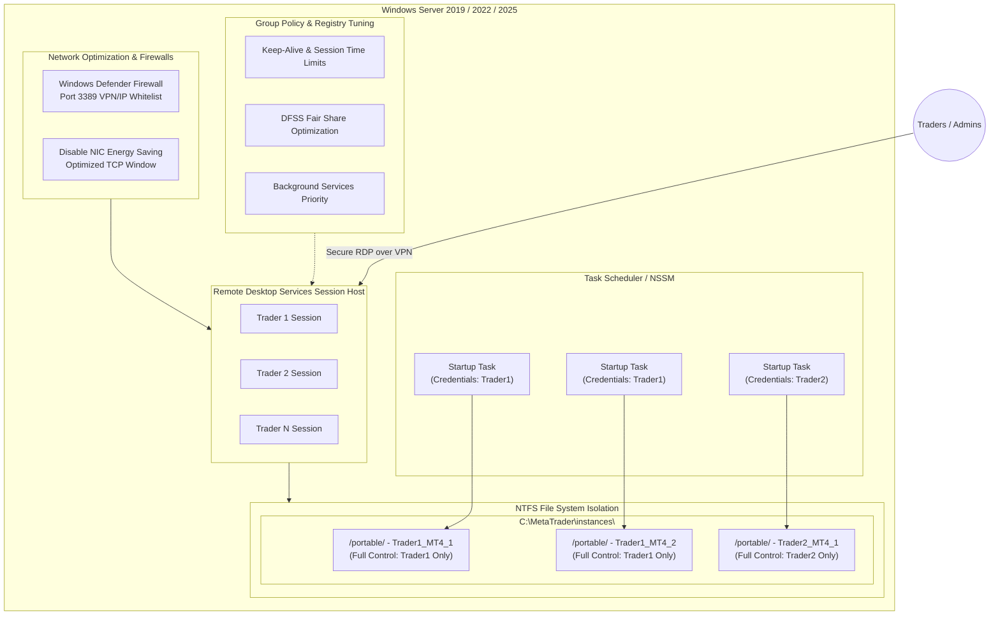

# Windows Server Multi-User Concurrent MetaTrader Architecture

This repository serves as the complete architectural reference and step-by-step implementation guide for configuring a high-availability, multi-user, and multi-session Windows Server environment optimized for running concurrent instances of **MetaTrader 4 (MT4)** and **MetaTrader 5 (MT5)**.

This setup is ideal for prop firms, trading groups, and quantitative asset managers who require multiple isolated traders or automated trading systems (EAs) to run concurrently on a single robust server without interference, resource starvation, or security cross-contamination.

---

## Project Overview

This repository provides comprehensive, production-grade documentation to set up, configure, and maintain a multi-user Windows Server environment from scratch to a fully operational production state. 

The architecture guarantees a secure, isolated, and highly optimized environment for concurrent remote users, characterized by:

*   **Concurrent Desktop Access:** Support for multiple concurrent user connections via Remote Desktop Protocol (RDP). Each user connects to their own isolated desktop environment simultaneously, ensuring zero conflicts, collisions, or session overlaps.
*   **Automated User & App Provisioning:** Automated user management, permission boundary creation, and portable application installations to eliminate manual setup tasks and guarantee configuration consistency.
*   **Granular Resource & Directory Isolation:** Each user operates within their own isolated context, mapping to secure `"Users"` directories. They have access to specific allocated resources and platforms while being strictly prevented from accessing other users' files, logs, or processes.
*   **Production-Ready Tuning:** Complete reference guides for GPO adjustments, registry optimization, Network Interface Card (NIC) performance, anti-malware exclusions, and automatic autostart boot tasks to ensure uninterrupted 24/7 background operation.

---

## Architectural Overview

Below is the conceptual architecture of the multi-user concurrent MetaTrader environment. It isolates each trader inside their own RDP session, leverages Windows Server Remote Desktop Session Host (RDSH), enforces strict NTFS-level isolation, and ensures high availability via automated startup scheduling.



---

## Table of Contents

1. [Hardware & Sizing Guide](#1-hardware--sizing-guide)
2. [Phase 1: Active Directory vs. Local Accounts & User Provisioning](#phase-1-active-directory-vs-local-accounts--user-provisioning)
3. [Phase 2: Remote Desktop Services (RDS) & Session Configuration](#phase-2-remote-desktop-services-rds--session-configuration)
4. [Phase 3: Windows GPO & Registry Performance Tuning](#phase-3-windows-gpo-and-registry-performance-tuning)
5. [Phase 4: Isolated Folder Structure & Portable MetaTrader Setup](#phase-4-isolated-folder-structure--portable-metatrader-setup)
6. [Phase 5: Automating Autostart & Unattended Operation](#phase-5-automating-autostart--unattended-operation)
7. [Phase 6: Network Optimization & Firewall Configuration](#phase-6-network-optimization--firewall-configuration)
8. [Phase 7: Monitoring, Maintenance, & Weekend Maintenance Scripts](#phase-7-monitoring-maintenance--weekend-maintenance-scripts)

---

## 1. Hardware & Sizing Guide

Before deploying the architecture, size the hardware based on the cumulative load of all concurrent users and their respective EAs:

*   **Memory (RAM) Guidelines:**
    *   **Base OS Overhead:** 2.5 GB to 4 GB.
    *   **MetaTrader 4 (MT4) Instance:** ~150 MB to 300 MB per terminal (varies based on chart count, history size, and EA complexity).
    *   **MetaTrader 5 (MT5) Instance:** ~250 MB to 500 MB per terminal.
    *   *Formula:* `Required RAM = Base OS + (Number of Instances * Average Instance RAM) + Buffer (15%)`
*   **Processor (CPU) Guidelines:**
    *   Avoid using low-power CPU cores. High single-core speed is critical for fast order execution and EA processing.
    *   Allocate **1 physical core (or 2 vCPUs)** for every **3 to 5 active MetaTrader terminals** running normal EAs.
    *   Allocate **1 physical core** for every **1 to 2 active terminals** performing heavy optimization or high-frequency grid trading.
*   **Storage (SSD/NVMe):**
    *   **Mandatory:** Use Enterprise-grade NVMe SSDs in a RAID-1 or RAID-10 array. Standard HDDs or slow cloud block storage will bottleneck disk I/O when writing log files, tick histories, and indicators across multiple concurrent users.

---

## Phase 1: Active Directory vs. Local Accounts & User Provisioning

Depending on scale, you can manage accounts locally (Workgroup) or centrally (Active Directory).

### Method A: Local User Management (For 2 to 15 Users)

To maintain strict security boundary separation, create standard (non-administrative) accounts for each trader:

1.  Open **Local Users and Groups** (`lusrmgr.msc`).
2.  Right-click **Users** -> **New User**.
3.  Fill out the user credentials (e.g., username: `trader01`, `trader02`) using high-entropy passwords. Ensure **User cannot change password** and **Password never expires** are checked (to prevent automated bots from failing due to sudden password changes).
4.  Create a dedicated security group named `MT-Traders`. Add all trader accounts to this group.
5.  Add the `MT-Traders` group (or individual users) to the built-in **Remote Desktop Users** group:
    ```powershell
    Add-LocalGroupMember -Group "Remote Desktop Users" -Member "trader01", "trader02"
    ```

### Method B: Active Directory Domain Services (For Large Scale)

If utilizing Active Directory (AD DS):
1.  Create an Organizational Unit (OU) named `Trading-Department`.
2.  Create Domain Users inside this OU.
3.  Create a Global Security Group named `GSG-MT-Traders`. Add all domain users to this group.
4.  Deploy a GPO targeting the terminal servers to add the `GSG-MT-Traders` group to the local `Remote Desktop Users` group automatically.

---

## Phase 2: Remote Desktop Services (RDS) & Session Configuration

By default, Windows Server only allows **2 concurrent administrative RDP sessions**. To enable multiple concurrent non-admin trader sessions, you must install the **Remote Desktop Services** role.

### Step 1: Role Installation

1.  Open **Server Manager** -> Click **Add Roles and Features**.
2.  Choose **Role-based or feature-based installation**.
3.  Select your local server.
4.  Check the box for **Remote Desktop Services**. Click Next.
5.  In the Role Services window, select:
    *   **Remote Desktop Session Host** (RDSH)
    *   **Remote Desktop Licensing** (RD Licensing)
6.  Proceed with installation and click **Install**.
7.  **Reboot the Server** to apply the configuration.

```powershell
# PowerShell Alternative for installing RDS Roles:
Install-WindowsFeature -Name RDS-RD-Server, RDS-Licensing -IncludeManagementTools -Restart
```

### Step 2: Configure RDS Licensing

After the reboot, you must configure a Licensing server and apply client access licenses (CALs). Running without a licensing server grants a **120-day grace period**, after which connections will fail.

1.  Open **Server Manager** -> **Tools** -> **Remote Desktop Services** -> **Remote Desktop Licensing Manager**.
2.  Right-click the server name and click **Activate Server**. Follow the wizard using your license key.
3.  Configure the Licensing Mode inside Local Group Policy (`gpedit.msc`) under:
    *   `Computer Configuration \ Administrative Templates \ Windows Components \ Remote Desktop Services \ Remote Desktop Session Host \ Licensing`
    *   **Use the specified Remote Desktop license servers**: *Enabled* (Enter `127.0.0.1` or the IP of your licensing server).
    *   **Set the Remote Desktop licensing mode**: *Enabled* -> Set to **Per User** (Recommended) or **Per Device**.

---

## Phase 3: Windows GPO and Registry Performance Tuning

Traders and EAs must remain online 24/7. Standard Windows Server GPOs will kill disconnected or idle sessions. This is unacceptable, as closing an RDP window would terminate all running MetaTrader terminals!

### 1. Configure Session GPOs (Prevent Session Termination)

Open Local Group Policy Editor (`gpedit.msc`) and navigate to:
`Computer Configuration \ Administrative Templates \ Windows Components \ Remote Desktop Services \ Remote Desktop Session Host \ Session Time Limits`

Configure the following:

| Group Policy Setting | Recommended State | Action |
| :--- | :--- | :--- |
| **Set time limit for disconnected sessions** | **Enabled** | Set to **Never** (This keeps the user's desktop, and all EAs, running when they exit RDP) |
| **Set time limit for active but idle RDS sessions** | **Enabled** | Set to **Never** |
| **Set time limit for active RDS sessions** | **Enabled** | Set to **Never** |
| **Terminate session when time limits are reached** | **Disabled** | Prevents Windows from killing sessions |

### 2. Configure Keep-Alive Connection GPOs (Prevent dropped RDP connections)

Navigate to:
`Computer Configuration \ Administrative Templates \ Windows Components \ Remote Desktop Services \ Remote Desktop Session Host \ Connections`

| Group Policy Setting | Recommended State | Value / Goal |
| :--- | :--- | :--- |
| **Configure Keep-Alive connection interval** | **Enabled** | Set to **1 minute** (Sends periodic ping packets to keep RDP connections active) |
| **Restrict Remote Desktop Services users to a single Remote Desktop Services session** | **Disabled** | Set to **Disabled** if you want users to be able to open multiple separate windows. Set to **Enabled** to force a clean resume of a single active desktop environment. |

Apply these GPOs immediately using PowerShell:
```powershell
gpupdate /force
```

### 3. Registry Optimizations for CPU Performance

Since MetaTrader is highly time-sensitive, optimize the OS kernel scheduling:

1.  **Set Processor Scheduling to Background Services:**
    This guarantees that background running EAs get priority CPU slices over foreground RDP GUI actions.
    *   Open `sysdm.cpl` (System Properties) -> **Advanced** tab -> Under *Performance*, click **Settings...**.
    *   Go to **Advanced** tab -> Under *Adjust for best performance of:*, select **Background Services**.
    *   Click Apply and OK.

2.  **Disable RDS Fair Share (Crucial MT4/MT5 Optimization):**
    By default, Windows Server uses **Dynamic Fair Share Scheduling (DFSS)** to balance CPU, Disk, and Network bandwidth among sessions. If one trader runs backtests or a CPU-heavy grid EA, Windows will heavily throttle their CPU execution. To disable this and allow full resource access:
    
    Open registry editor (`regedit`) and make the following changes:
    *   **CPU Fair Share:**
        *   Path: `HKEY_LOCAL_MACHINE\SYSTEM\CurrentControlSet\Control\Session Manager\Quota System`
        *   Value: `DisableDFSS` (DWORD) -> Set to `1`
    *   **Disk Fair Share:**
        *   Path: `HKEY_LOCAL_MACHINE\SYSTEM\CurrentControlSet\Services\TSFairShare\Disk`
        *   Value: `EnableFairShare` (DWORD) -> Set to `0`
    *   **Network Fair Share:**
        *   Path: `HKEY_LOCAL_MACHINE\SYSTEM\CurrentControlSet\Services\TSFairShare\NetFS`
        *   Value: `EnableFairShare` (DWORD) -> Set to `0`

```powershell
# PowerShell commands to disable Fair Share:
Set-ItemProperty -Path "HKLM:\SYSTEM\CurrentControlSet\Control\Session Manager\Quota System" -Name "DisableDFSS" -Value 1 -Type DWord
Set-ItemProperty -Path "HKLM:\SYSTEM\CurrentControlSet\Services\TSFairShare\Disk" -Name "EnableFairShare" -Value 0 -Type DWord
Set-ItemProperty -Path "HKLM:\SYSTEM\CurrentControlSet\Services\TSFairShare\NetFS" -Name "EnableFairShare" -Value 0 -Type DWord
```

---

## Phase 4: Isolated Folder Structure & Portable MetaTrader Setup

To prevent traders from accessing, viewing, or editing other traders' indicators, bots, or log files, you must establish an isolated filesystem layout.

### The Portable Mode `/portable` Requirement

When running MetaTrader in standard mode, configuration and EA data is stored inside a randomized subfolder in `%APPDATA%` (e.g., `C:\Users\<Username>\AppData\Roaming\MetaQuotes\Terminal\<RandomID>`).
For structured server deployment, we enforce **Portable Mode**, which stores all config, indicator, log, and EA data directly inside the installation directory, simplifying automated backups, provisioning, and permissions management.

### Step 1: Directory Structure Layout

Create a standardized folder hierarchy on your fastest drive:
```text
C:\MetaTrader\
├── base\                     <-- Original MetaTrader installation source (Read-Only)
└── instances\                <-- Directory containing all running instances
    ├── trader01\             <-- Trader 1 isolation directory
    │   ├── MT4_Primary\      <-- Portably launched MT4 Instance 1
    │   └── MT5_Secondary\    <-- Portably launched MT5 Instance 2
    └── trader02\             <-- Trader 2 isolation directory
        └── MT4_Primary\      <-- Portably launched MT4 Instance 1
```

### Step 2: Deploying the Structure and Applying Strict NTFS Permissions

Using strict Access Control Lists (ACLs), ensure each user has absolute access to their own instance directories while blocking read/write access to everyone else (except system administrators).

Here is a PowerShell automation script to provision a trader directory with hardened permissions:

```powershell
# Define Variables
$BaseDir = "C:\MetaTrader\instances"
$TraderUser = "trader01"
$TraderFolder = "$BaseDir\$TraderUser"

# 1. Create Directories
New-Item -Path $TraderFolder -ItemType Directory -Force

# 2. Disable NTFS Inheritance and Remove Default 'Users' Access
$Acl = Get-Acl $TraderFolder
$Acl.SetAccessRuleProtection($true, $true) # Protect ACL, keep inherited entries to copy first
Set-Acl $TraderFolder $Acl

# 3. Explicitly Remove 'Users' and 'Authenticated Users'
$Acl = Get-Acl $TraderFolder
$RulesToRemove = $Acl.Access | Where-Object { $_.IdentityReference -like "*Users*" -or $_.IdentityReference -like "*Everyone*" }
foreach ($Rule in $RulesToRemove) {
    $Acl.RemoveAccessRule($Rule)
}

# 4. Add Full Control Permissions for SYSTEM, Administrators, and the specific Trader
$SystemRule = New-Object System.Security.AccessControl.FileSystemAccessRule("NT AUTHORITY\SYSTEM", "FullControl", "ContainerInherit,ObjectInherit", "None", "Allow")
$AdminRule = New-Object System.Security.AccessControl.FileSystemAccessRule("BUILTIN\Administrators", "FullControl", "ContainerInherit,ObjectInherit", "None", "Allow")
$TraderRule = New-Object System.Security.AccessControl.FileSystemAccessRule($TraderUser, "FullControl", "ContainerInherit,ObjectInherit", "None", "Allow")

$Acl.AddAccessRule($SystemRule)
$Acl.AddAccessRule($AdminRule)
$Acl.AddAccessRule($TraderRule)

# 5. Apply the secured ACL to the user's directory
Set-Acl $TraderFolder $Acl
Write-Host "NTFS folder isolation applied successfully for $TraderUser!" -ForegroundColor Green
```

### Step 3: MetaTrader Portable Installation Procedure

1.  Download the official MetaTrader MT4/MT5 setup wrapper.
2.  Install MetaTrader to the baseline directory: `C:\MetaTrader\base\MT4_Base` (or `MT5_Base`).
3.  Copy the entire `MT4_Base` directory contents.
4.  Paste those contents into the trader's target folder, e.g., `C:\MetaTrader\instances\trader01\MT4_Primary`.
5.  Create a desktop shortcut inside the trader's profile (`C:\Users\trader01\Desktop`) pointing to:
    *   Target: `C:\MetaTrader\instances\trader01\MT4_Primary\terminal.exe /portable`
    *   Start in: `C:\MetaTrader\instances\trader01\MT4_Primary`
    *   *Note the mandatory inclusion of the `/portable` flag!*

---

## Phase 5: Automating Autostart & Unattended Operation

Windows Server will periodically reboot due to power cycling, virtualization hypervisor migrations, or automated security patches. If the server reboots, all MetaTrader terminals will go offline.
**We must autostart all MetaTrader terminals in their respective user contexts without requiring traders to manually log in.**

### Recommended Method: Windows Task Scheduler (No Active Session Required)

You can schedule MetaTrader terminals to start directly on system boot, running entirely in the background as the designated trader user.

#### Manual Configuration via Task Scheduler:
1.  Open **Task Scheduler** (`taskschd.msc`).
2.  Click **Create Task...** (Do not use *Basic Task*).
3.  **General Tab:**
    *   Name: `Autostart_Trader01_MT4_Primary`
    *   Security Options -> Change User or Group: Set to **trader01**.
    *   Select **Run whether user is logged on or not**.
    *   Check **Run with highest privileges** (Required for bypass of basic system execution blocks).
    *   Configure for: **Windows Server 2022** (or your exact OS version).
4.  **Triggers Tab:**
    *   Click **New...**
    *   Begin the task: **At startup**
    *   Advanced settings -> Check **Delay task for**: **30 seconds** (highly recommended to allow network interfaces, active directories, and databases to initialize first).
5.  **Actions Tab:**
    *   Click **New...**
    *   Action: **Start a program**
    *   Program/script: `C:\MetaTrader\instances\trader01\MT4_Primary\terminal.exe`
    *   Add arguments (optional): `/portable`
    *   Start in: `C:\MetaTrader\instances\trader01\MT4_Primary`
6.  **Settings Tab:**
    *   Uncheck **Stop the task if it runs longer than**.
    *   If the task fails, restart every: **1 minute**, Attempt up to **3 times**.
7.  Click **OK**. You will be prompted to enter the password for `trader01`.

```powershell
# PowerShell Script to quickly create the Autostart Boot Task:
$TaskName = "Autostart_Trader01_MT4_Primary"
$User = "trader01"
$Password = "YourHighEntropyPasswordHere!"
$ExePath = "C:\MetaTrader\instances\trader01\MT4_Primary\terminal.exe"
$WorkingDir = "C:\MetaTrader\instances\trader01\MT4_Primary"

$Action = New-ScheduledTaskAction -Execute $ExePath -Argument "/portable" -WorkingDirectory $WorkingDir
$Trigger = New-ScheduledTaskTrigger -AtStartup -Delay (New-TimeSpan -Seconds 30)
$Principal = New-ScheduledTaskPrincipal -UserId $User -LogonType Password -RunLevel Highest
$Settings = New-ScheduledTaskSettingsSet -AllowStartIfOnBatteries -DontStopIfGoingOnBatteries -StartWhenAvailable -RestartCount 3 -RestartInterval (New-TimeSpan -Minutes 1)

$Task = New-ScheduledTask -Action $Action -Trigger $Trigger -Principal $Principal -Settings $Settings
Register-ScheduledTask -TaskName $TaskName -InputObject $Task -User $User -Password $Password
```

---

## Phase 6: Network Optimization & Firewall Configuration

Trading terminals are highly sensitive to network dropouts and latency spikes. Configure system networking to prioritize performance over power saving.

### 1. Disable Network Interface Card (NIC) Energy Saving
1.  Open Device Manager (`devmgmt.msc`).
2.  Expand **Network adapters**.
3.  Right-click your active network card (e.g., Intel/Mellanox/Amazon Elastic Network Adapter) -> **Properties**.
4.  Go to the **Power Management** tab.
5.  **Uncheck** `Allow the computer to turn off this device to save power`.
6.  Go to the **Advanced** tab. Set **Energy Efficient Ethernet** or **Green Ethernet** to **Disabled**.

### 2. Firewall Optimization
By default, MetaTrader terminals connect to broker servers over outbound connections. Ensure outbound traffic is unrestricted for MT4/MT5.
If security standards dictate a highly locked-down outbound firewall:
*   Allow outgoing TCP ports **443** (SSL), **1950** (Standard MT4/MT5 live tick data), and **4443** (Alternative Broker API ports).

For secure remote admin/trader login:
1.  **Do not expose port 3389 directly to the public internet.**
2.  Set up a local VPN Server (e.g., WireGuard or OpenVPN) or run standard RDP traffic through an SSH Tunnel.
3.  If a VPN is not possible, restrict RDP access to trusted static IP addresses using a Windows Defender Firewall rule.

```powershell
# PowerShell script to restrict RDP traffic to a specific management subnet:
Set-NetFirewallRule -Name "RemoteDesktop-UserMode-In-TCP" -RemoteAddress "203.0.113.50/32, 198.51.100.0/24"
```

---

## Phase 7: Monitoring, Maintenance, & Weekend Maintenance Scripts

Continuous operation requires automated management, health checks, and scheduled maintenance periods.

### 1. Antivirus Folder Exclusions
Running EAs perform frequent read/write actions on disk. Windows Defender Real-Time protection scans every temporary trade and history write, causing CPU spikes.
1.  Open **Windows Security** -> **Virus & threat protection** -> **Manage settings**.
2.  Under **Exclusions**, click **Add or remove exclusions**.
3.  Select **Folder** and choose `C:\MetaTrader\`.

### 2. Log Cleanup Script (Weekend Purge)
MetaTrader terminals generate enormous volume of log files over time. If left unmanaged, logs will consume the primary storage drive and crash the server. Run this script via Task Scheduler every Saturday night:

```powershell
# Purge MT4/MT5 logs older than 14 days
$TargetDir = "C:\MetaTrader\instances"
$DaysOld = 14

Get-ChildItem -Path $TargetDir -Recurse -Include "*.log" | Where-Object {
    $_.LastWriteTime -lt (Get-Date).AddDays(-$DaysOld)
} | Remove-Item -Force -ErrorAction SilentlyContinue

Write-Host "Log clean completed successfully!" -ForegroundColor Green
```

### 3. Automated Weekend Reboot Script
Windows Server benefits heavily from periodic reboots to clear memory leaks. Because markets close on weekends, schedule a clean system reboot every Saturday at 22:00 UTC (after market close).

This script will gracefully terminate MT4/MT5 terminals first to prevent history files from corrupting, wait 30 seconds, and then initiate an OS reboot.

```powershell
# Saturday Night Graceful Shutdown & Reboot Script
# 1. Gracefully terminate terminal processes
Get-Process -Name "terminal" -ErrorAction SilentlyContinue | Stop-Process -Force

# 2. Wait for writes to disk to finish
Start-Sleep -Seconds 15

# 3. Initiate system reboot with warning
Restart-Computer -Force -Confirm:$false -Delay 10
```

Deploy the reboot script as a scheduled task running as `NT AUTHORITY\SYSTEM` on a weekly schedule.

---

## Verification & Deployment Checklists

Before handing off the environment to the traders, run this checklist:

*   [ ] Verify licensing status: Run `tlsmgr.msc` and confirm licensing is active.
*   [ ] Test isolated directories: Log in as `trader02` and confirm you cannot read or open `C:\MetaTrader\instances\trader01\`.
*   [ ] Test disconnected sessions: Log in via RDP, start MetaTrader, close the RDP client window (do not log out). Reconnect and verify the MetaTrader window is still fully active.
*   [ ] Test autostart: Reboot the server, wait 60 seconds, log in, and verify the `terminal.exe` process is running in Task Manager under each user's credentials.
*   [ ] Ensure Windows Defender exclusions are active for `C:\MetaTrader`.
