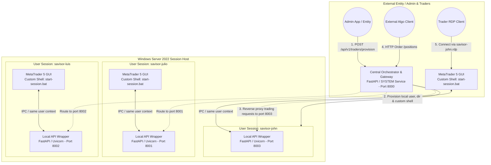
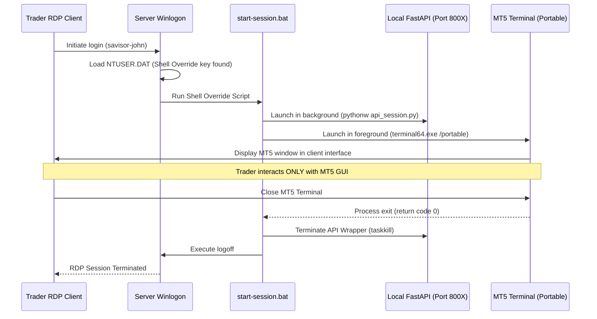

# Windows Server Multi-User Concurrent MetaTrader Architecture

This repository serves as the complete architectural reference and step-by-step implementation guide for configuring a high-availability, multi-user, and multi-session Windows Server environment optimized for running concurrent instances of **MetaTrader 5 (MT5)**.

This setup is ideal for prop firms, trading groups, and quantitative asset managers who require multiple isolated traders or automated trading systems (EAs) to run concurrently on a single robust server. The architecture guarantees absolute isolation, security, and automated execution without session overlaps, desktop collisions, or cross-contamination.

---

## Project Overview

This repository provides comprehensive, production-grade documentation to set up, configure, and maintain a multi-user Windows Server environment from scratch to a fully operational production state. 

The architecture guarantees a secure, isolated, and highly optimized environment for concurrent remote users, characterized by:

*   **Central Administration Orchestrator:** An external-facing admin service that listens to provisioning commands, programmatically spins up Windows users, builds sandbox directories, configures credentials, and compiles optimized connection profiles.
*   **Seamless Application Isolation:** Restricts users via Custom Shell Overrides. When a trader connects over RDP, they see *only* their designated MetaTrader 5 interface in a seamless window or full screen. The Windows Server desktop, Explorer shell, and filesystem remain completely hidden and inaccessible.
*   **Session-Isolated loopback APIs:** A FastAPI trading wrapper utilizing Python `MetaTrader5`, `pandas`, `numpy`, and `psutil` running *inside* each user session. This solves MT5's session-specific Inter-Process Communication (IPC) limitations by binding dedicated loopback ports per user.
*   **API Gateway Router:** A secure reverse-proxy that exposes a single public entry point on the server to route trading commands safely to the appropriate local user session loopback port.

---

## Architectural Layout

The diagram below maps the three-tier architecture showing the external admin provisioning API, the seamless RDP exposure, and the reverse-proxy loopback routing:



---

## Table of Contents

1. [Hardware & Sizing Guide](#1-hardware--sizing-guide)
2. [Phase 0: AWS EC2 Windows Server Provisioning (Development)](#phase-0-aws-ec2-windows-server-provisioning-development)
3. [Phase 1: Central Orchestrator & API Gateway Setup](#phase-1-central-orchestrator--api-gateway-setup)
4. [Phase 2: Custom Shell Override & RemoteApp Integration](#phase-2-custom-shell-override--remoteapp-integration)
5. [Phase 3: Session-Isolated Loopback API Wrapper](#phase-3-session-isolated-loopback-api-wrapper)
6. [Phase 4: Management & Verification Workflows](#phase-4-management--verification-workflows)

---

## 1. Hardware & Sizing Guide

Before deploying the architecture, size the hardware based on the cumulative load of all concurrent users and their respective EAs:

*   **Memory (RAM) Guidelines:**
    *   **Base OS Overhead:** 2.5 GB to 4 GB.
    *   **MetaTrader 5 (MT5) Instance:** ~250 MB to 500 MB per terminal (varies based on chart count, history size, and EA complexity).
    *   *Formula:* `Required RAM = Base OS + (Number of Instances * Average Instance RAM) + Buffer (15%)`
*   **Processor (CPU) Guidelines:**
    *   Avoid low-power CPU cores. Single-thread processing speed is critical for fast order execution.
    *   Allocate **1 physical core (or 2 vCPUs)** for every **3 to 5 active MetaTrader terminals** running normal EAs.
*   **Storage (SSD/NVMe):**
    *   **Mandatory:** Use Enterprise-grade NVMe SSDs. Fast, high-IOPS storage is critical for concurrent log writes, tick histories, and indicators across multiple concurrent users.

---

## Phase 0: AWS EC2 Windows Server Provisioning (Development)

For development and testing environments supporting a maximum of **5 concurrent MetaTrader terminals**, a small, cost-effective EC2 instance is highly recommended to minimize operational costs while satisfying all architectural requirements.

### Development Sizing Configuration
*   **Instance Type:** `t3.medium` (2 vCPUs, 4 GB RAM). This is sufficient for development purposes running up to 5 lightweight MetaTrader terminals under lean OS configurations.
*   **Storage:** 40 GB `gp3` SSD (EBS volume). Fast, high-IOPS storage is critical for concurrent log writes.
*   **Operating System:** Windows Server 2022 English Full Base (`ami-0909cee4864578472`).

Below is the automated step-by-step deployment using the AWS CLI under the `--profile julio` profile.

### Step 1: Provisioning the AWS Environment via AWS CLI

Run the following commands locally to prepare the security groups, SSH key pairs, and launch the development instance:

1.  **Retrieve the Latest Windows Server 2022 AMI:**
    Identify the latest Windows Server 2022 English Full Base AMI in your region (default: `us-east-1`):
    ```bash
    aws ec2 describe-images \
        --profile julio \
        --owners amazon \
        --filters "Name=name,Values=Windows_Server-2022-English-Full-Base-*" "Name=state,Values=available" \
        --query "sort_by(Images, &CreationDate)[-1].ImageId" \
        --output text
    # Output: ami-0909cee4864578472
    ```

2.  **Create a Dedicated Key Pair:**
    Generate an EC2 Key Pair named `mt-dev-key` and securely download the private `.pem` key:
    ```bash
    aws ec2 create-key-pair \
        --profile julio \
        --key-name mt-dev-key \
        --query "KeyMaterial" \
        --output text > mt-dev-key.pem

    # Restrict permissions on the private key file
    chmod 400 mt-dev-key.pem
    ```

3.  **Create a Secure Security Group:**
    Create a new security group named `mt-dev-sg` within your default VPC (e.g., `vpc-0bc96c10cb1e9608c`):
    ```bash
    aws ec2 create-security-group \
        --profile julio \
        --group-name mt-dev-sg \
        --description "Security group for MetaTrader Dev Server" \
        --vpc-id vpc-0bc96c10cb1e9608c \
        --query "GroupId" \
        --output text
    # Output: sg-0e8caf65de1b6c8c6
    ```

4.  **Lock Down Inbound Remote Desktop (RDP) Traffic:**
    Authorize port 3389 (RDP) and port 8000 (Central API) only from your specific management public IP address (e.g., `38.252.111.234/32`) to prevent public exposure:
    ```bash
    aws ec2 authorize-security-group-ingress \
        --profile julio \
        --group-id sg-0e8caf65de1b6c8c6 \
        --protocol tcp \
        --port 3389 \
        --cidr 38.252.111.234/32

    aws ec2 authorize-security-group-ingress \
        --profile julio \
        --group-id sg-0e8caf65de1b6c8c6 \
        --protocol tcp \
        --port 8000 \
        --cidr 38.252.111.234/32
    ```

5.  **Launch the EC2 Development Instance:**
    Spin up the `t3.medium` instance using the parameters established above:
    ```bash
    aws ec2 run-instances \
        --profile julio \
        --image-id ami-0909cee4864578472 \
        --count 1 \
        --instance-type t3.medium \
        --key-name mt-dev-key \
        --security-group-ids sg-0e8caf65de1b6c8c6 \
        --associate-public-ip-address \
        --block-device-mappings '[{"DeviceName":"/dev/sda1","Ebs":{"VolumeSize":40,"VolumeType":"gp3"}}]' \
        --tag-specifications 'ResourceType=instance,Tags=[{Key=Name,Value=MT-SRV-DEV-01}]' \
        --query "Instances[0].InstanceId" \
        --output text
    # Output: i-0abcf66cf0d99f8c1
    ```

6.  **Retrieve Instance Public IP:**
    Query the public IP address of the newly provisioned development instance:
    ```bash
    aws ec2 describe-instances \
        --profile julio \
        --instance-ids i-0abcf66cf0d99f8c1 \
        --query "Reservations[0].Instances[0].PublicIpAddress" \
        --output text
    # Output: 44.203.211.14
    ```

7.  **Decrypt the Windows Administrator Password:**
    After waiting 3-4 minutes for Windows to initialize, decrypt the password using your local private key:
    ```bash
    aws ec2 get-password-data \
        --profile julio \
        --instance-id i-0abcf66cf0d99f8c1 \
        --priv-launch-key mt-dev-key.pem
    ```

---

## Phase 1: Central Orchestrator & API Gateway Setup

The **Central Orchestrator** is a Python FastAPI service running continuously under the Windows `SYSTEM` account (or an elevated administrator service). It listens on **port 8000** for instructions from the external administrative dashboard to:
1. Dynamically provision new local Windows users.
2. Initialize isolated MT5 directories and files.
3. Configure the user's registry shell overrides.
4. Route API requests from the external world directly to the trader's session-isolated FastAPI server via reverse-proxying.

### Step 1: Base Environment Setup
On the Windows Server, create the base directories and install required dependencies. Open an elevated PowerShell prompt:

```powershell
# Create root directory structures
New-Item -ItemType Directory -Path "C:\MetaTrader\instances" -Force
New-Item -ItemType Directory -Path "C:\MetaTrader\master" -Force
New-Item -ItemType Directory -Path "C:\MetaTrader\orchestrator" -Force

# Install system-wide Python dependencies using uv (or standard pip)
python -m pip install fastapi uvicorn pydantic psutil pywin32 pandas numpy httpx python-multipart
```

> [!TIP]
> Always place a clean, fully configured portable MT5 terminal into `C:\MetaTrader\master\`. This will serve as our golden base image. Each new trader directory will copy this base folder, allowing rapid, clean provisioning.

### Step 2: The Central Orchestrator API (`orchestrator.py`)
Save the following file in `C:\MetaTrader\orchestrator\orchestrator.py`. It provides endpoints for external admin apps and handles dynamic RDP configuration compilation and trading traffic reverse-proxying:

```python
# C:\MetaTrader\orchestrator\orchestrator.py
import os
import shutil
import string
import random
import subprocess
import httpx
from fastapi import FastAPI, HTTPException, Request, Response
from pydantic import BaseModel

app = FastAPI(title="MetaTrader Central Orchestrator", version="1.0.0")

# Port mappings: Map trader name to their loopback port
PORT_MAPPING = {
    "julio": 8001,
    "luis": 8002,
    "john": 8003
}

class ProvisionRequest(BaseModel):
    organization: str
    trader_name: str

def generate_random_password(length=18):
    chars = string.ascii_letters + string.digits + "!@#$"
    return "".join(random.choice(chars) for _ in range(length))

@app.post("/api/v1/traders/provision")
async def provision_trader(payload: ProvisionRequest):
    org = payload.organization.lower()
    trader = payload.trader_name.lower()
    username = f"{org}-{trader}"
    
    if trader not in PORT_MAPPING:
        raise HTTPException(status_code=400, detail=f"Trader '{trader}' has no loopback port configured.")

    port = PORT_MAPPING[trader]
    user_dir = f"C:\\Users\\{username}"
    instance_dir = f"C:\\MetaTrader\\instances\\{username}"
    master_dir = "C:\\MetaTrader\\master"

    # 1. Create Windows User via PowerShell
    password = generate_random_password()
    ps_cmd = f"""
    $SecPassword = ConvertTo-SecureString "{password}" -AsPlainText -Force
    $UserExist = Get-LocalUser -Name "{username}" -ErrorAction SilentlyContinue
    if (-not $UserExist) {{
        New-LocalUser -Name "{username}" -Password $SecPassword -Description "MT5 Trader {trader}" -PasswordNeverExpires -UserMayNotChangePassword | Out-Null
        Add-LocalGroupMember -Group "Remote Desktop Users" -Member "{username}"
        
        $GroupExist = Get-LocalGroup -Name "{org}-traders" -ErrorAction SilentlyContinue
        if (-not $GroupExist) {{
            New-LocalGroup -Name "{org}-traders"
        }}
        Add-LocalGroupMember -Group "{org}-traders" -Member "{username}"
    }}
    """
    subprocess.run(["powershell", "-Command", ps_cmd], check=True)

    # 2. Copy Base Portable Terminal
    if not os.path.exists(master_dir):
        raise HTTPException(status_code=500, detail="Master terminal template does not exist.")
    
    if not os.path.exists(instance_dir):
        os.makedirs(instance_dir, exist_ok=True)
        shutil.copytree(master_dir, os.path.join(instance_dir, "terminal"), dirs_exist_ok=True)
    
    # 3. Mount Registry Hive & Apply Custom Shell Override
    # This replaces explorer.exe for this user, hiding the desktop and forcing MT5 GUI to launch
    reg_cmd = f"""
    $userDir = "{user_dir}"
    if (-not (Test-Path $userDir)) {{
        New-Item -ItemType Directory -Path $userDir -Force | Out-Null
        Copy-Item "C:\\Users\\Default\\NTUSER.DAT" "$userDir\\NTUSER.DAT" -Force
    }}
    # Load registry hive offline
    reg load HKLM\\TempHive_{username} "$userDir\\NTUSER.DAT"
    
    # Write custom shell
    $keyPath = "HKLM:\\TempHive_{username}\\Software\\Microsoft\\Windows NT\\CurrentVersion\\Winlogon"
    if (-not (Test-Path $keyPath)) {{
        New-Item -Path $keyPath -Force | Out-Null
    }}
    Set-ItemProperty -Path $keyPath -Name "Shell" -Value "{instance_dir}\\start-session.bat" -Force
    
    # Unload registry hive
    [gc]::Collect()
    reg unload HKLM\\TempHive_{username}
    """
    subprocess.run(["powershell", "-Command", reg_cmd], check=True)

    # 4. Generate startup scripts for the local user session
    # start-session.bat starts the API wrapper in background, and launches MT5 in foreground.
    # Closing MT5 will kill the session.
    start_session_content = f"""@echo off
cd /d "{instance_dir}"
start "" /b pythonw "{instance_dir}\\api_session.py" --port {port}
"{instance_dir}\\terminal\\terminal64.exe" /portable
taskkill /F /IM pythonw.exe
logoff
"""
    with open(f"{instance_dir}\\start-session.bat", "w") as f:
        f.write(start_session_content)

    # Copy the API wrapper code into the user's sandbox folder
    shutil.copy("C:\\MetaTrader\\orchestrator\\api_session_template.py", f"{instance_dir}\\api_session.py")

    # Grant user full control over their directory sandbox
    acl_cmd = f'icacls "{instance_dir}" /grant "{username}:(OI)(CI)F" /T'
    subprocess.run(acl_cmd, shell=True, check=True)

    # 5. Generate client RDP connection file
    # Uses RDP remoteapplicationmode (RemoteApp) to expose ONLY the window
    rdp_content = f"""full address:s:localhost
username:s:{username}
screen mode id:i:2
use multimon:i:0
session bpp:i:32
remoteapplicationmode:i:1
remoteapplicationprogram:s:{instance_dir}\\start-session.bat
remoteapplicationname:s:MetaTrader 5 - {trader.capitalize()}
"""
    rdp_path = f"{instance_dir}\\{username}.rdp"
    with open(rdp_path, "w") as f:
        f.write(rdp_content)

    return {
        "status": "success",
        "message": f"Trader {username} provisioned successfully.",
        "port": port,
        "password": password,
        "rdp_profile": rdp_path
    }

# 6. Gateway API Route: Reverse Proxies calls to the trader's session-isolated loopback API
@app.api_route("/api/v1/traders/{trader_name}/api/{path:path}", methods=["GET", "POST", "DELETE", "PUT"])
async def route_trader_request(trader_name: str, path: str, request: Request):
    trader = trader_name.lower()
    if trader not in PORT_MAPPING:
        raise HTTPException(status_code=404, detail="Trader not registered.")
    
    port = PORT_MAPPING[trader]
    url = f"http://127.0.0.1:{port}/{path}"
    
    async with httpx.AsyncClient() as client:
        body = await request.body()
        params = dict(request.query_params)
        headers = dict(request.headers)
        headers.pop("host", None) # Let httpx reconstruct Host
        
        try:
            res = await client.request(
                method=request.method,
                url=url,
                headers=headers,
                params=params,
                content=body,
                timeout=30.0
            )
            return Response(content=res.content, status_code=res.status_code, headers=dict(res.headers))
        except httpx.ConnectError:
            raise HTTPException(status_code=503, detail=f"Trader session '{trader}' API wrapper is offline. Ensure the user RDP session is active.")

if __name__ == "__main__":
    import uvicorn
    uvicorn.run(app, host="0.0.0.0", port=8000)
```

---

## Phase 2: Custom Shell Override & RemoteApp Integration

Exposing the server's full remote desktop allows users to access file systems, launch arbitrary processes, and compromise server integrity. Our architecture uses **Custom User-Level Shell Overrides** to restrict access entirely.

### Custom Session Lifecycle Control
Instead of running `explorer.exe` (which loads the desktop, taskbar, and file browser) as the user shell, Windows mounts our `start-session.bat` script during the initial RDP handshakes:

1. **Active Hooking:** The user initiates an RDP login.
2. **Registry Execution:** Windows checks `HKCU\Software\Microsoft\Windows NT\CurrentVersion\Winlogon\Shell`. Finding a script path, it bypasses the explorer shell.
3. **Loopback API Activation:** The script executes a background, non-interactive python process containing the session-isolated API wrapper (`api_session.py`).
4. **Foreground Program Launch:** The script launches MetaTrader 5 inside the foreground `/portable` session.
5. **Lock-in Guard:** The user interacts with the MT5 GUI directly. Minimized windows yield a blank background (no desktop icons or file manager are rendered).
6. **Graceful Tear Down:** When the trader closes the MT5 window, the script catches the execution return, forcefully terminates the background Python service, and executes `logoff`, tearing down the RDP user session.



---

## Phase 3: Session-Isolated Loopback API Wrapper

The official MetaTrader 5 Python integration communicates using Windows session handles. If Python runs under a different user profile, it cannot interact with another session's MT5 window.

### Step 1: Session-Isolated API Design (`api_session_template.py`)
To bypass this limitation, we place a custom Python API template inside `C:\MetaTrader\orchestrator\api_session_template.py`. When a new trader is provisioned, this template is copied directly to their sandbox directory and initialized:

```python
# C:\MetaTrader\orchestrator\api_session_template.py
import argparse
import sys
import psutil
import pandas as pd
import numpy as np
from fastapi import FastAPI, HTTPException
from pydantic import BaseModel
import MetaTrader5 as mt5

app = FastAPI(title="Session MT5 Loopback API")

class LoginRequest(BaseModel):
    login: int
    password: str
    server: str

class OrderRequest(BaseModel):
    symbol: str
    volume: float
    action: str  # BUY / SELL
    price: float = None
    sl: float = None
    tp: float = None

@app.post("/login")
def login_broker(payload: LoginRequest):
    # Initialize connection to terminal locally
    if not mt5.initialize():
        raise HTTPException(status_code=500, detail=f"MT5 initialization failed: {mt5.last_error()}")
    
    # Perform login
    authorized = mt5.login(
        login=payload.login,
        password=payload.password,
        server=payload.server
    )
    if not authorized:
        raise HTTPException(status_code=401, detail=f"Broker login failed: {mt5.last_error()}")
    
    return {"status": "success", "message": f"Successfully logged into account {payload.login}"}

@app.get("/account")
def get_account_info():
    info = mt5.account_info()
    if info is None:
        raise HTTPException(status_code=500, detail=f"Failed to fetch account info: {mt5.last_error()}")
    return info._asdict()

@app.post("/order")
def send_order(payload: OrderRequest):
    # Map actions
    action_type = mt5.ORDER_TYPE_BUY if payload.action.upper() == "BUY" else mt5.ORDER_TYPE_SELL
    
    # Resolve Price if not provided
    price = payload.price
    if not price:
        tick = mt5.symbol_info_tick(payload.symbol)
        if not tick:
            raise HTTPException(status_code=400, detail=f"Failed to fetch symbol ask/bid: {mt5.last_error()}")
        price = tick.ask if payload.action.upper() == "BUY" else tick.bid

    request = {
        "action": mt5.TRADE_ACTION_DEAL,
        "symbol": payload.symbol,
        "volume": payload.volume,
        "type": action_type,
        "price": price,
        "sl": payload.sl or 0.0,
        "tp": payload.tp or 0.0,
        "deviation": 20,
        "magic": 123456,
        "comment": "FastAPI Auto-order",
        "type_time": mt5.ORDER_TIME_GTC,
        "type_filling": mt5.ORDER_FILLING_FOK,
    }

    result = mt5.order_send(request)
    if result.retcode != mt5.TRADE_RETCODE_DONE:
        raise HTTPException(status_code=400, detail=f"Order rejected: retcode={result.retcode}, comment={result.comment}")
    
    return result._asdict()

@app.get("/positions")
def get_positions(symbol: str = None):
    # Retrieve active open positions
    positions = mt5.positions_get(symbol=symbol) if symbol else mt5.positions_get()
    if positions is None:
        return {"positions": []}
    
    # Process array with Pandas to convert NumPy types safely into JSON
    df = pd.DataFrame(list(positions), columns=positions[0]._asdict().keys() if len(positions) > 0 else [])
    df = df.replace({np.nan: None})
    return {"positions": df.to_dict(orient="records")}

@app.get("/health")
def get_health():
    # Gather CPU and memory usage statistics
    proc = psutil.Process()
    return {
        "status": "healthy",
        "pid": proc.pid,
        "cpu_percent": proc.cpu_percent(),
        "memory_info": proc.memory_info()._asdict()
    }

if __name__ == "__main__":
    parser = argparse.ArgumentParser()
    parser.add_argument("--port", type=int, default=8001)
    args = parser.parse_args()
    
    import uvicorn
    uvicorn.run(app, host="127.0.0.1", port=args.port)
```

---

## Phase 4: Management & Verification Workflows

Use the steps below to verify your dynamic, three-trader environment provisioning (`savisor-julio`, `savisor-luis`, `savisor-john`) and confirm active reverse-proxy routing:

### Step 1: Launch the Central Orchestrator
Start the orchestrator locally inside an elevated command window:
```cmd
python C:\MetaTrader\orchestrator\orchestrator.py
```

### Step 2: Trigger Provisioning calls
From your administration program (or curl command client), run the provisioner for all three accounts:

```bash
# Provision savisor-julio
curl -X POST http://localhost:8000/api/v1/traders/provision \
  -H "Content-Type: application/json" \
  -d '{"organization": "savisor", "trader_name": "julio"}'

# Provision savisor-luis
curl -X POST http://localhost:8000/api/v1/traders/provision \
  -H "Content-Type: application/json" \
  -d '{"organization": "savisor", "trader_name": "luis"}'

# Provision savisor-john
curl -X POST http://localhost:8000/api/v1/traders/provision \
  -H "Content-Type: application/json" \
  -d '{"organization": "savisor", "trader_name": "john"}'
```

### Step 3: Connect to the Isolated RDP Shell
Download the compiled `savisor-john.rdp` file generated in `C:\MetaTrader\instances\savisor-john\savisor-john.rdp` and launch it:
1. Provide the credentials (generated password returned in the provision JSON response).
2. The RDP session opens and launches *only* the MetaTrader 5 GUI inside the screen space.
3. Observe that there is no Windows Server desktop, Explorer shell, or Start menu accessible.
4. Try closing the MT5 application window. Note that the RDP session immediately disconnects and signs off.

### Step 4: Programmatically Interact Externally
While John's terminal is active under his RDP session, your external application can trade and query metrics directly via our reverse-proxy gateway on port 8000. Each request is securely directed internally to port 8003:

```bash
# Get health and CPU metrics for John's session API
curl http://localhost:8000/api/v1/traders/john/api/health

# Perform login for John's terminal to his broker account
curl -X POST http://localhost:8000/api/v1/traders/john/api/login \
  -H "Content-Type: application/json" \
  -d '{"login": 5012345, "password": "BrokerPassword", "server": "MetaQuotes-Demo"}'

# Send an automated market buy order to John's terminal
curl -X POST http://localhost:8000/api/v1/traders/john/api/order \
  -H "Content-Type: application/json" \
  -d '{"symbol": "EURUSD", "volume": 0.1, "action": "BUY"}'

# Retrieve active open positions
curl http://localhost:8000/api/v1/traders/john/api/positions
```
