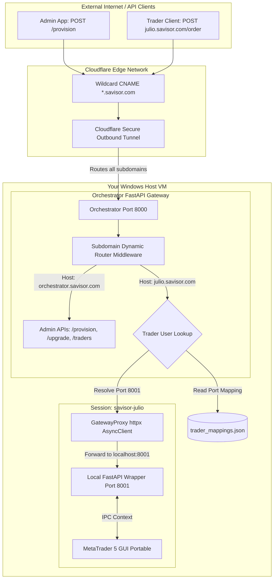
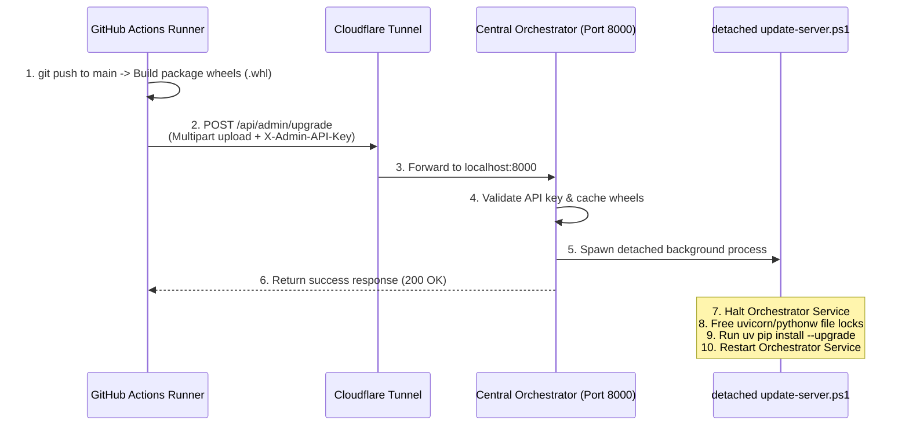

# Windows Server Multi-User Concurrent MetaTrader Architecture

This repository serves as the complete architectural reference, configuration guide, and deployment automation source for running a secure, high-availability, multi-user, and multi-session Windows Server environment optimized for concurrent instances of **MetaTrader 5 (MT5)**.

This setup is ideal for proprietary trading firms, institutional quant desks, and asset management groups who require multiple isolated traders or automated trading systems (Expert Advisors) to run concurrently on a single robust host. The architecture guarantees absolute isolation, robust security, and automated execution without session overlaps, desktop collisions, or cross-contamination.

---

## 🏗️ System Architecture & Workflow

The architecture segregates the **infrastructure creation** (AWS EC2 / Day 0) from the **operating system bootstrapping and continuous software updates** (Day 1+), ensuring the application layer remains **100% provider-agnostic** and can be deployed on AWS, Contabo, Hetzner, OVHcloud, or local bare metal.



### Core Architecture Components

1. **Central Orchestrator & Gateway (Port 8000)**: A Python FastAPI application running as a persistent Windows Service under the elevated `SYSTEM` context. It handles administrative tasks (creating users, directory setup, custom shell injections) and acts as the central reverse-proxy router.
2. **FastAPI Subdomain Middleware**: Intercepts all incoming requests, parses the `Host` header (e.g. `julio.savisor.com`), resolves the trader context via `TraderStore`, and proxies traffic to their localized loopback port.
3. **Session-Isolated Loopback APIs (Ports 8001-8050)**: A separate FastAPI application running *inside* each logged-on Windows trader session. It speaks directly with that session's MT5 instance via the official Windows-bound python `MetaTrader5` API, avoiding Session 0 isolation constraints.
4. **Interactive Session Monitor (`session-monitor.ps1`)**: A lightweight supervisor script running under the logged-in user profile that manages self-healing process recovery for the wrapper API and executes a clean logoff when the MT5 terminal window is closed.
5. **Zero-Inbound Cloudflare Tunnel**: Standardizes host ingress by routing traffic exclusively via outbound secure connections. The server's firewall keeps all public inbound ports **fully blocked** (including HTTP 80/443 and API 8000), eliminating public attack surfaces.

---

## 🔐 Security & Directory Sandboxing

To support concurrent multi-session traders without process collisions or data leakage, the provisioning engine enforces absolute sandboxing at the Windows filesystem level using programmatic Windows NTFS Access Control Lists (ACLs):

```
C:\savisor\
├── .env                       <-- Core Environment Variables [SYSTEM & Administrators: Full Control ONLY]
├── .venv\                     <-- Global Python Venv [Standard Users: Read & Execute Only]
├── terminal\                  <-- Golden Master MT5 Terminal [Standard Users: Read & Execute Only]
├── scripts\                   <-- Central Session Supervisors [Standard Users: Read & Execute Only]
├── logs\                      <-- Central Service Logs [Standard Users: Read Only]
└── instances\
    ├── savisor-john\          <-- John's Private Sandbox Folder [FULL CONTROL: savisor-john ONLY]
    │   └── terminal\          <-- Copy of MT5 Portable [No access to any other trader]
    └── savisor-julio\         <-- Julio's Private Sandbox Folder [FULL CONTROL: savisor-julio ONLY]
        └── terminal\          <-- Copy of MT5 Portable [No access to any other trader]
```

### Filesystem Isolation Rules (NTFS ACLs via `icacls.exe`)
During provisioning, the Orchestrator automatically:
1. **Breaks Inheritance**: Executes `/inheritance:d` on the trader's sandbox folder to prevent default parent permissions from leaking open access.
2. **Strips General Groups**: Explicitly removes standard `Users` and `Everyone` groups access.
3. **Restricts to Owner**: Grants explicit Full Control (`F`) recursively (`(OI)(CI)`) *only* to the specific trader user and the `Administrators` security principal.

---

## 🛠️ Infrastructure Provisioning & Bootstrapping (Day 0)

Our infrastructure layer is written in **Terraform** to deploy a production Windows Server 2022 instance on **AWS**.

### Configuration Parameters (`terraform/variables.tf`)

| Variable Name | Type | Description | Default Value |
| :--- | :--- | :--- | :--- |
| `aws_region` | `string` | AWS region to deploy resources | `"us-east-1"` |
| `aws_profile` | `string` | AWS CLI profile name for authentication | `"julio"` |
| `environment` | `string` | Deployment environment name | `"production"` |
| `instance_type` | `string` | EC2 Instance type for the Windows host | `"t3.large"` |
| `key_name` | `string` | Name of the EC2 Key Pair for administrator login | `"mt-dev-key"` |
| `allowed_rdp_cidr` | `string` | CIDR block allowed to access host RDP port (3389) | `"38.252.111.234/32"` |
| `github_repository`| `string` | Target repository containing bootstrapping scripts | `"devffex/experiment-windows-server-metatrader"` |
| `base_domain` | `string` | Base domain name for wildcard routing and DNS | `"savisor.com"` |
| `cloudflare_token` | `string` | Cloudflare Tunnel client token for secure exposure | *Sensitive Placeholder* |
| `admin_api_key` | `string` | Secure admin API key for authenticating upgrades | *Sensitive Placeholder* |

### First-Boot VM Bootstrapping Script
The EC2 instance's `user_data` script (defined inside `terraform/main.tf`):
1. Creates `C:\savisor` directories.
2. Generates the secure `.env` file injecting all variables from Terraform at build-time.
3. Locks down the `.env` permissions to `SYSTEM` and `Administrators`.
4. Downloads the portable `bootstrap-server.ps1` from your GitHub repository.
5. Runs the bootstrapping script:
   - Installs system-wide Python 3.10 and Git.
   - Sets up the global virtualenv (`C:\savisor\.venv`) and installs packages in editable mode using `uv`.
   - Quietly installs the golden master MT5 terminal, sets it up in `/portable` mode, and registers `cloudflared.exe`.
   - Starts the background services (`SavisorOrchestrator` and `cloudflared`).

---

## 📡 Dynamic Wildcard Subdomain Gateway Routing

Instead of routing through nested URL paths (e.g. `api.savisor.com/api/v1/traders/julio/api/...`), we route all external requests dynamically to user subdomains. Adding a new trader is instantaneous, requiring **zero Cloudflare configuration reloads, service restarts, or DNS additions**.

### How to Configure Wildcard DNS & Tunnel Ingress

#### 1. Configure Cloudflare DNS
Add the following CNAME records in your Cloudflare dashboard:
* **Record 1 (Wildcard User Routing)**:
  * **Type**: `CNAME`
  * **Name**: `*` (matches `*.savisor.com`)
  * **Target**: `<your-cloudflare-tunnel-id>.cfargotunnel.com`
  * **Proxy Status**: Proxied (Orange cloud enabled)
* **Record 2 (Central Admin Panel)**:
  * **Type**: `CNAME`
  * **Name**: `orchestrator` (matches `orchestrator.savisor.com`)
  * **Target**: `<your-cloudflare-tunnel-id>.cfargotunnel.com`
  * **Proxy Status**: Proxied (Orange cloud enabled)

#### 2. Define Static Ingress Rules in `tunnel-config.yaml`
Configure your host's local Cloudflare config (`C:\savisor\tunnel-config.yaml`) to route all subdomain traffic to our central Orchestrator Gateway on Port `8000`:
```yaml
tunnel: your-cloudflare-tunnel-uuid
credentials-file: C:\savisor\your-tunnel-credentials.json

ingress:
  - hostname: orchestrator.savisor.com
    service: http://localhost:8000
  - hostname: "*.savisor.com"
    service: http://localhost:8000
  - service: http_status:404
```

---

## 🚀 Continuous Integration & Secure Upgrade API (CI/CD)

The code deployment is 100% decoupled from AWS primitives (S3, SSM Run Command, IAM roles). Releases are compiled as wheels (`.whl`) in GitHub Actions and pushed directly over standard secure HTTPS to the Orchestrator's Upgrade REST endpoint `/upgrade`.



### GitHub Actions Secrets Required
To enable automated deployments, configure two secrets under your GitHub repository:
- **`SAVISOR_API_URL`**: The base URL of your central orchestrator (e.g. `https://orchestrator.savisor.com`).
- **`SAVISOR_ADMIN_API_KEY`**: The exact administration key matching the `ORCHESTRATOR_ADMIN_API_KEY` set inside the server's `.env`.

---

## 📋 Configuration & Environment Variables Reference

A single configuration file `C:\savisor\.env` manages settings for all components:

```env
# Cloudflare Tunnel Configuration
CLOUDFLARE_TUNNEL_TOKEN=your-cloudflare-tunnel-client-token-here

# Authentication Credentials
ORCHESTRATOR_ADMIN_API_KEY=your-highly-secure-admin-api-key-here

# Base Domain and Routing Rules
ORCHESTRATOR_BASE_DOMAIN=savisor.com

# Repository Mapping
GITHUB_REPOSITORY=devffex/experiment-windows-server-metatrader
```

---

## 💻 Local Development & Execution Runbook

Follow these instructions to run the application components locally, execute automated tests, and manually verify subdomain routing.

### 1. Synchronize Python Environments
We utilize `uv` to manage the workspace. Navigate to your workspace root directory and sync all packages and dev-dependencies:
```powershell
uv sync --all-packages
```

### 2. Running the Central Orchestrator Gateway Locally
Start the Orchestrator in local mode listening on Port `8000`:
```powershell
uv run uvicorn orchestrator.main:app --host 127.0.0.1 --port 8000
```

### 3. Running the Automated Test Suite
Our testing framework validates the custom subdomain middleware, reserved routing paths, port-suffix stripping, and fallback handlers. To execute the unit tests, run:
```powershell
uv run python -m unittest discover -s apps/orchestrator/tests -p "test_*.py"
```

### 4. Simulating Subdomain Ingress Manually (Local Header Injection)
You can test dynamic subdomain routing locally using standard `curl` commands by injecting custom `Host` headers without modifying any local DNS hosts file:

* **Verify central admin portal access**:
  ```bash
  curl -H "Host: orchestrator.savisor.com" http://127.0.0.1:8000/traders
  ```
  *Expected response*: HTTP status `200 OK` listing provisioned traders.

* **Verify access to unregistered subdomains**:
  ```bash
  curl -H "Host: unknown.savisor.com" http://127.0.0.1:8000/api/positions
  ```
  *Expected response*: HTTP status `404 Not Found` with a specific `"Trader subdomain 'unknown' is not provisioned on this host"` message.

* **Verify access to a registered active user (e.g. `julio` running on port 8001)**:
  * Launch a mock endpoint on port `8001` or start a session RDP.
  ```bash
  curl -H "Host: julio.savisor.com" http://127.0.0.1:8000/health
  ```
  *Expected response*: HTTP status `200 OK` forwarding the exact response from `http://127.0.0.1:8001/health`.
