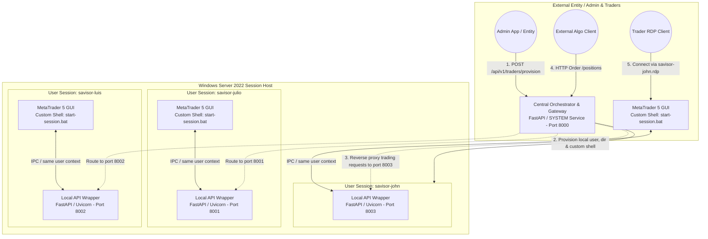
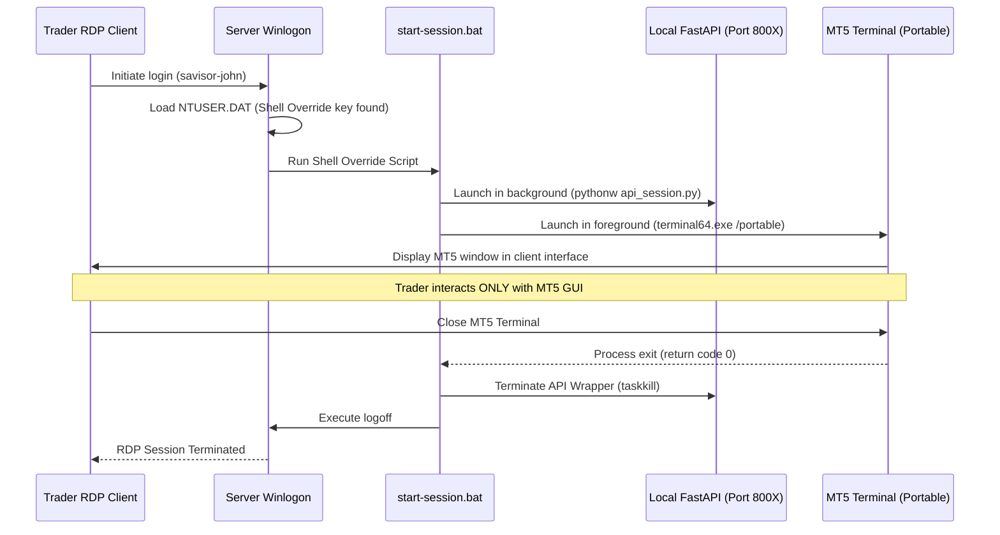
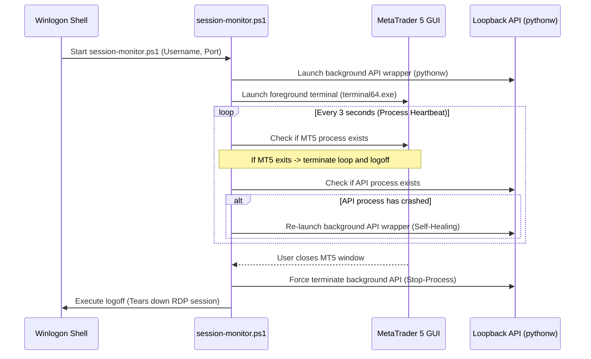
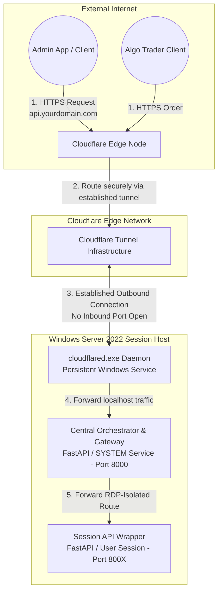

# Windows Server Multi-User Concurrent MetaTrader Architecture

This repository serves as the complete architectural reference and step-by-step implementation guide for configuring a high-availability, multi-user, and multi-session Windows Server environment optimized for running concurrent instances of **MetaTrader 5 (MT5)**.

This setup is ideal for prop firms, trading groups, and quantitative asset managers who require multiple isolated traders or automated trading systems (EAs) to run concurrently on a single robust server. The architecture guarantees absolute isolation, security, and automated execution without session overlaps, desktop collisions, or cross-contamination.

---

## Project Overview

This repository provides comprehensive, production-grade documentation to set up, configure, and maintain a multi-user Windows Server environment from scratch to a fully operational production state. 

The architecture guarantees a secure, isolated, and highly optimized environment for concurrent remote users, characterized by:

*   **Central Administration Orchestrator:** An external-facing admin service that listens to provisioning commands, programmatically spins up Windows users, builds sandbox directories, configures credentials, and compiles optimized connection profiles.
*   **Seamless Application Isolation:** Restricts users via Custom Shell Overrides. When a trader connects over RDP, they see *only* their designated MetaTrader 5 interface in a seamless window or full screen. The Windows Server desktop, Explorer shell, and filesystem remain completely hidden and inaccessible.
*   **Session-Isolated loopback APIs:** A FastAPI trading wrapper utilizing Python `MetaTrader5`, `pandas`, `numpy`, and `psutil` running *inside* each user session. This solves MT5's session-specific Inter-Process Communication (IPC) limitations by binding dedicated loopback ports per user.
*   **API Gateway Router:** A secure reverse-proxy that exposes a single public entry point on the server to route trading commands safely to the appropriate local user session loopback port.

---

## Architectural Layout

The diagram below maps the three-tier architecture showing the external admin provisioning API, the seamless RDP exposure, and the reverse-proxy loopback routing:



---

## Table of Contents

1. [Hardware & Sizing Guide](#1-hardware--sizing-guide)
2. [Phase 0: AWS EC2 Windows Server Provisioning (Development)](#phase-0-aws-ec2-windows-server-provisioning-development)
3. [Phase 1: Central Orchestrator & API Gateway Setup](#phase-1-central-orchestrator--api-gateway-setup)
4. [Phase 2: Custom Shell Override & RemoteApp Integration](#phase-2-custom-shell-override--remoteapp-integration)
5. [Phase 3: Session-Isolated Loopback API Wrapper](#phase-3-session-isolated-loopback-api-wrapper)
6. [Phase 4: Management & Verification Workflows](#phase-4-management--verification-workflows)
7. [Phase 5: Resilient Service Daemons & Session Process Supervisors](#phase-5-resilient-service-daemons--session-process-supervisors)
8. [Phase 6: Automated Server Provisioning, Folder Lockdown, and Cloudflare Tunnel Secure Exposure](#phase-6-automated-server-provisioning-folder-lockdown-and-cloudflare-tunnel-secure-exposure)

---

## 1. Hardware & Sizing Guide

Before deploying the architecture, size the hardware based on the cumulative load of all concurrent users and their respective EAs:

*   **Memory (RAM) Guidelines:**
    *   **Base OS Overhead:** 2.5 GB to 4 GB.
    *   **MetaTrader 5 (MT5) Instance:** ~250 MB to 500 MB per terminal (varies based on chart count, history size, and EA complexity).
    *   *Formula:* `Required RAM = Base OS + (Number of Instances * Average Instance RAM) + Buffer (15%)`
*   **Processor (CPU) Guidelines:**
    *   Avoid low-power CPU cores. Single-thread processing speed is critical for fast order execution.
    *   Allocate **1 physical core (or 2 vCPUs)** for every **3 to 5 active MetaTrader terminals** running normal EAs.
*   **Storage (SSD/NVMe):**
    *   **Mandatory:** Use Enterprise-grade NVMe SSDs. Fast, high-IOPS storage is critical for concurrent log writes, tick histories, and indicators across multiple concurrent users.

---

## Phase 0: AWS EC2 Windows Server Provisioning (Development)

For development and testing environments supporting a maximum of **5 concurrent MetaTrader terminals**, a small, cost-effective EC2 instance is highly recommended to minimize operational costs while satisfying all architectural requirements.

### Development Sizing Configuration
*   **Instance Type:** `t3.medium` (2 vCPUs, 4 GB RAM). This is sufficient for development purposes running up to 5 lightweight MetaTrader terminals under lean OS configurations.
*   **Storage:** 40 GB `gp3` SSD (EBS volume). Fast, high-IOPS storage is critical for concurrent log writes.
*   **Operating System:** Windows Server 2022 English Full Base (`ami-0909cee4864578472`).

Below is the automated step-by-step deployment using the AWS CLI under the `--profile julio` profile.

### Step 1: Provisioning the AWS Environment via AWS CLI

Run the following commands locally to prepare the security groups, SSH key pairs, and launch the development instance:

1.  **Retrieve the Latest Windows Server 2022 AMI:**
    Identify the latest Windows Server 2022 English Full Base AMI in your region (default: `us-east-1`):
    ```bash
    aws ec2 describe-images \
        --profile julio \
        --owners amazon \
        --filters "Name=name,Values=Windows_Server-2022-English-Full-Base-*" "Name=state,Values=available" \
        --query "sort_by(Images, &CreationDate)[-1].ImageId" \
        --output text
    # Output: ami-0909cee4864578472
    ```

2.  **Create a Dedicated Key Pair:**
    Generate an EC2 Key Pair named `mt-dev-key` and securely download the private `.pem` key:
    ```bash
    aws ec2 create-key-pair \
        --profile julio \
        --key-name mt-dev-key \
        --query "KeyMaterial" \
        --output text > mt-dev-key.pem

    # Restrict permissions on the private key file
    chmod 400 mt-dev-key.pem
    ```

3.  **Create a Secure Security Group:**
    Create a new security group named `mt-dev-sg` within your default VPC (e.g., `vpc-0bc96c10cb1e9608c`):
    ```bash
    aws ec2 create-security-group \
        --profile julio \
        --group-name mt-dev-sg \
        --description "Security group for MetaTrader Dev Server" \
        --vpc-id vpc-0bc96c10cb1e9608c \
        --query "GroupId" \
        --output text
    # Output: sg-0e8caf65de1b6c8c6
    ```

4.  **Lock Down Inbound Remote Desktop (RDP) Traffic:**
    Authorize port 3389 (RDP) and port 8000 (Central API) only from your specific management public IP address (e.g., `38.252.111.234/32`) to prevent public exposure:
    ```bash
    aws ec2 authorize-security-group-ingress \
        --profile julio \
        --group-id sg-0e8caf65de1b6c8c6 \
        --protocol tcp \
        --port 3389 \
        --cidr 38.252.111.234/32

    aws ec2 authorize-security-group-ingress \
        --profile julio \
        --group-id sg-0e8caf65de1b6c8c6 \
        --protocol tcp \
        --port 8000 \
        --cidr 38.252.111.234/32
    ```

5.  **Launch the EC2 Development Instance:**
    Spin up the `t3.medium` instance using the parameters established above:
    ```bash
    aws ec2 run-instances \
        --profile julio \
        --image-id ami-0909cee4864578472 \
        --count 1 \
        --instance-type t3.medium \
        --key-name mt-dev-key \
        --security-group-ids sg-0e8caf65de1b6c8c6 \
        --associate-public-ip-address \
        --block-device-mappings '[{"DeviceName":"/dev/sda1","Ebs":{"VolumeSize":40,"VolumeType":"gp3"}}]' \
        --tag-specifications 'ResourceType=instance,Tags=[{Key=Name,Value=MT-SRV-DEV-01}]' \
        --query "Instances[0].InstanceId" \
        --output text
    # Output: i-0abcf66cf0d99f8c1
    ```

6.  **Retrieve Instance Public IP:**
    Query the public IP address of the newly provisioned development instance:
    ```bash
    aws ec2 describe-instances \
        --profile julio \
        --instance-ids i-0abcf66cf0d99f8c1 \
        --query "Reservations[0].Instances[0].PublicIpAddress" \
        --output text
    # Output: 44.203.211.14
    ```

7.  **Decrypt the Windows Administrator Password:**
    After waiting 3-4 minutes for Windows to initialize, decrypt the password using your local private key:
    ```bash
    aws ec2 get-password-data \
        --profile julio \
        --instance-id i-0abcf66cf0d99f8c1 \
        --priv-launch-key mt-dev-key.pem
    ```

---

## Phase 1: Central Orchestrator & API Gateway Setup

The **Central Orchestrator** is a Python FastAPI service running continuously under the Windows `SYSTEM` account (or an elevated administrator service). It listens on **port 8000** for instructions from the external administrative dashboard to:
1. Dynamically provision new local Windows users.
2. Initialize isolated MT5 directories and files.
3. Configure the user's registry shell overrides.
4. Route API requests from the external world directly to the trader's session-isolated FastAPI server via reverse-proxying.

### Step 1: Base Environment Setup
On the Windows Server, create the base directories and install required dependencies. Open an elevated PowerShell prompt:

```powershell
# Create root directory structures
New-Item -ItemType Directory -Path "C:\MetaTrader\instances" -Force
New-Item -ItemType Directory -Path "C:\MetaTrader\master" -Force
New-Item -ItemType Directory -Path "C:\MetaTrader\orchestrator" -Force

# Install system-wide Python dependencies using uv (or standard pip)
python -m pip install fastapi uvicorn pydantic psutil pywin32 pandas numpy httpx python-multipart
```

> [!TIP]
> Always place a clean, fully configured portable MT5 terminal into `C:\MetaTrader\master\`. This will serve as our golden base image. Each new trader directory will copy this base folder, allowing rapid, clean provisioning.

### Step 2: The Central Orchestrator API (`orchestrator.py`)
Save the following file in `C:\MetaTrader\orchestrator\orchestrator.py`. It provides endpoints for external admin apps and handles dynamic RDP configuration compilation and trading traffic reverse-proxying:

```python
# C:\MetaTrader\orchestrator\orchestrator.py
import os
import shutil
import string
import random
import subprocess
import httpx
from fastapi import FastAPI, HTTPException, Request, Response
from pydantic import BaseModel

app = FastAPI(title="MetaTrader Central Orchestrator", version="1.0.0")

# Port mappings: Map trader name to their loopback port
PORT_MAPPING = {
    "julio": 8001,
    "luis": 8002,
    "john": 8003
}

class ProvisionRequest(BaseModel):
    organization: str
    trader_name: str

def generate_random_password(length=18):
    chars = string.ascii_letters + string.digits + "!@#$"
    return "".join(random.choice(chars) for _ in range(length))

@app.post("/api/v1/traders/provision")
async def provision_trader(payload: ProvisionRequest):
    org = payload.organization.lower()
    trader = payload.trader_name.lower()
    username = f"{org}-{trader}"
    
    if trader not in PORT_MAPPING:
        raise HTTPException(status_code=400, detail=f"Trader '{trader}' has no loopback port configured.")

    port = PORT_MAPPING[trader]
    user_dir = f"C:\\Users\\{username}"
    instance_dir = f"C:\\MetaTrader\\instances\\{username}"
    master_dir = "C:\\MetaTrader\\master"

    # 1. Create Windows User via PowerShell
    password = generate_random_password()
    ps_cmd = f"""
    $SecPassword = ConvertTo-SecureString "{password}" -AsPlainText -Force
    $UserExist = Get-LocalUser -Name "{username}" -ErrorAction SilentlyContinue
    if (-not $UserExist) {{
        New-LocalUser -Name "{username}" -Password $SecPassword -Description "MT5 Trader {trader}" -PasswordNeverExpires -UserMayNotChangePassword | Out-Null
        Add-LocalGroupMember -Group "Remote Desktop Users" -Member "{username}"
        
        $GroupExist = Get-LocalGroup -Name "{org}-traders" -ErrorAction SilentlyContinue
        if (-not $GroupExist) {{
            New-LocalGroup -Name "{org}-traders"
        }}
        Add-LocalGroupMember -Group "{org}-traders" -Member "{username}"
    }}
    """
    subprocess.run(["powershell", "-Command", ps_cmd], check=True)

    # 2. Copy Base Portable Terminal
    if not os.path.exists(master_dir):
        raise HTTPException(status_code=500, detail="Master terminal template does not exist.")
    
    if not os.path.exists(instance_dir):
        os.makedirs(instance_dir, exist_ok=True)
        shutil.copytree(master_dir, os.path.join(instance_dir, "terminal"), dirs_exist_ok=True)
    
    # 3. Mount Registry Hive & Apply Custom Shell Override
    # This replaces explorer.exe for this user, hiding the desktop and forcing MT5 GUI to launch
    reg_cmd = f"""
    $userDir = "{user_dir}"
    if (-not (Test-Path $userDir)) {{
        New-Item -ItemType Directory -Path $userDir -Force | Out-Null
        Copy-Item "C:\\Users\\Default\\NTUSER.DAT" "$userDir\\NTUSER.DAT" -Force
    }}
    # Load registry hive offline
    reg load HKLM\\TempHive_{username} "$userDir\\NTUSER.DAT"
    
    # Write custom shell
    $keyPath = "HKLM:\\TempHive_{username}\\Software\\Microsoft\\Windows NT\\CurrentVersion\\Winlogon"
    if (-not (Test-Path $keyPath)) {{
        New-Item -Path $keyPath -Force | Out-Null
    }}
    Set-ItemProperty -Path $keyPath -Name "Shell" -Value "{instance_dir}\\start-session.bat" -Force
    
    # Unload registry hive
    [gc]::Collect()
    reg unload HKLM\\TempHive_{username}
    """
    subprocess.run(["powershell", "-Command", reg_cmd], check=True)

    # 4. Generate startup scripts for the local user session
    # start-session.bat starts the API wrapper in background, and launches MT5 in foreground.
    # Closing MT5 will kill the session.
    start_session_content = f"""@echo off
cd /d "{instance_dir}"
start "" /b pythonw "{instance_dir}\\api_session.py" --port {port}
"{instance_dir}\\terminal\\terminal64.exe" /portable
taskkill /F /IM pythonw.exe
logoff
"""
    with open(f"{instance_dir}\\start-session.bat", "w") as f:
        f.write(start_session_content)

    # Copy the API wrapper code into the user's sandbox folder
    shutil.copy("C:\\MetaTrader\\orchestrator\\api_session_template.py", f"{instance_dir}\\api_session.py")

    # Grant user full control over their directory sandbox
    acl_cmd = f'icacls "{instance_dir}" /grant "{username}:(OI)(CI)F" /T'
    subprocess.run(acl_cmd, shell=True, check=True)

    # 5. Generate client RDP connection file
    # Uses RDP remoteapplicationmode (RemoteApp) to expose ONLY the window
    rdp_content = f"""full address:s:localhost
username:s:{username}
screen mode id:i:2
use multimon:i:0
session bpp:i:32
remoteapplicationmode:i:1
remoteapplicationprogram:s:{instance_dir}\\start-session.bat
remoteapplicationname:s:MetaTrader 5 - {trader.capitalize()}
"""
    rdp_path = f"{instance_dir}\\{username}.rdp"
    with open(rdp_path, "w") as f:
        f.write(rdp_content)

    return {
        "status": "success",
        "message": f"Trader {username} provisioned successfully.",
        "port": port,
        "password": password,
        "rdp_profile": rdp_path
    }

# 6. Gateway API Route: Reverse Proxies calls to the trader's session-isolated loopback API
@app.api_route("/api/v1/traders/{trader_name}/api/{path:path}", methods=["GET", "POST", "DELETE", "PUT"])
async def route_trader_request(trader_name: str, path: str, request: Request):
    trader = trader_name.lower()
    if trader not in PORT_MAPPING:
        raise HTTPException(status_code=404, detail="Trader not registered.")
    
    port = PORT_MAPPING[trader]
    url = f"http://127.0.0.1:{port}/{path}"
    
    async with httpx.AsyncClient() as client:
        body = await request.body()
        params = dict(request.query_params)
        headers = dict(request.headers)
        headers.pop("host", None) # Let httpx reconstruct Host
        
        try:
            res = await client.request(
                method=request.method,
                url=url,
                headers=headers,
                params=params,
                content=body,
                timeout=30.0
            )
            return Response(content=res.content, status_code=res.status_code, headers=dict(res.headers))
        except httpx.ConnectError:
            raise HTTPException(status_code=503, detail=f"Trader session '{trader}' API wrapper is offline. Ensure the user RDP session is active.")

if __name__ == "__main__":
    import uvicorn
    uvicorn.run(app, host="0.0.0.0", port=8000)
```

---

## Phase 2: Custom Shell Override & RemoteApp Integration

Exposing the server's full remote desktop allows users to access file systems, launch arbitrary processes, and compromise server integrity. Our architecture uses **Custom User-Level Shell Overrides** to restrict access entirely.

### Custom Session Lifecycle Control
Instead of running `explorer.exe` (which loads the desktop, taskbar, and file browser) as the user shell, Windows mounts our `start-session.bat` script during the initial RDP handshakes:

1. **Active Hooking:** The user initiates an RDP login.
2. **Registry Execution:** Windows checks `HKCU\Software\Microsoft\Windows NT\CurrentVersion\Winlogon\Shell`. Finding a script path, it bypasses the explorer shell.
3. **Loopback API Activation:** The script executes a background, non-interactive python process containing the session-isolated API wrapper (`api_session.py`).
4. **Foreground Program Launch:** The script launches MetaTrader 5 inside the foreground `/portable` session.
5. **Lock-in Guard:** The user interacts with the MT5 GUI directly. Minimized windows yield a blank background (no desktop icons or file manager are rendered).
6. **Graceful Tear Down:** When the trader closes the MT5 window, the script catches the execution return, forcefully terminates the background Python service, and executes `logoff`, tearing down the RDP user session.



---

## Phase 3: Session-Isolated Loopback API Wrapper

The official MetaTrader 5 Python integration communicates using Windows session handles. If Python runs under a different user profile, it cannot interact with another session's MT5 window.

### Step 1: Session-Isolated API Design (`main.py`)
To bypass this limitation, we run a session-isolated FastAPI server (`main.py`) under each provisioned Windows user session. This server communicates synchronously with the local MT5 terminal and exposes REST endpoints.

Programmatic login endpoints (like `/login` or `/authenticate`) have been **completely removed** to maximize security. Users must authenticate manually inside the terminal GUI when they connect via Remote Desktop (RDP).

Here is the structured architecture of our loopback API:

```python
# apps/session-wrapper/src/session_wrapper/main.py
import argparse
import sys
import psutil
import pandas as pd
import numpy as np
from fastapi import FastAPI, HTTPException
from shared_schemas import *

app = FastAPI(title="Session MT5 loopback API")

# (Exposes 29 REST endpoints corresponding to the MetaTrader 5 Python API)
```

---

## Phase 4: Management & Verification Workflows

Use the steps below to verify your dynamic, three-trader environment provisioning (`savisor-julio`, `savisor-luis`, `savisor-john`) and confirm active reverse-proxy routing:

### Step 1: Launch the Central Orchestrator
Start the orchestrator locally inside an elevated command window:
```cmd
python C:\MetaTrader\orchestrator\orchestrator.py
```

### Step 2: Trigger Provisioning Calls
From your administration program (or curl command client), run the provisioner for all three accounts:

```bash
# Provision savisor-julio
curl -X POST http://localhost:8000/api/v1/traders/provision \
  -H "Content-Type: application/json" \
  -d '{"organization": "savisor", "trader_name": "julio"}'

# Provision savisor-luis
curl -X POST http://localhost:8000/api/v1/traders/provision \
  -H "Content-Type: application/json" \
  -d '{"organization": "savisor", "trader_name": "luis"}'

# Provision savisor-john
curl -X POST http://localhost:8000/api/v1/traders/provision \
  -H "Content-Type: application/json" \
  -d '{"organization": "savisor", "trader_name": "john"}'
```

### Step 3: Connect and Authenticate Manually via RDP
Download the compiled `savisor-john.rdp` file generated in `C:\MetaTrader\instances\savisor-john\savisor-john.rdp` and launch it:
1. Provide the credentials (generated password returned in the provision JSON response).
2. The RDP session opens and launches *only* the MetaTrader 5 GUI inside the screen space.
3. **Manual Authentication:** Inside the MT5 GUI, navigate to `File -> Login to Trade Account` and manually enter your broker login, password, and server. This removes the risk of passing trade credentials through insecure REST payloads.
4. Try closing the MT5 application window. Note that the RDP session immediately disconnects and signs off.

### Step 4: Programmatically Interact Externally
While John's terminal is active under his RDP session and manually authenticated, your external application can trade and query metrics directly via our reverse-proxy gateway on port 8000. Each request is securely directed internally to port 8003:

```bash
# Get health and CPU metrics for John's session API
curl http://localhost:8000/api/v1/traders/john/api/health

# Send an automated market buy order to John's terminal (price is automatically resolved from current tick ask)
curl -X POST http://localhost:8000/api/v1/traders/john/api/order \
  -H "Content-Type: application/json" \
  -d '{"symbol": "EURUSD", "volume": 0.1, "action": "BUY"}'

# Retrieve active open positions
curl http://localhost:8000/api/v1/traders/john/api/positions
```

---

## Phase 5: Resilient Service Daemons & Session Process Supervisors

To ensure high-availability and self-healing operations, both the **Central Orchestrator** and the **Session-Isolated loopback APIs** are configured to run as resilient, supervised background daemons.

### 1. Central Orchestrator System Service (NSSM)

The Central Orchestrator must run continuously, start automatically on system reboots without user logon, and auto-restart immediately if it crashes. 

We utilize **NSSM (Non-Sucking Service Manager)** to wrap our Python Uvicorn server as a formal Windows Service. 

#### Installation & Configuration
An administrative PowerShell script `apps/orchestrator/install-orchestrator-service.ps1` automates this entire setup:
1. **Administrative Check**: Ensures the installer runs under an elevated Administrator shell.
2. **Dynamic Dependency Gathering**: Downloads NSSM from its official source if not present, and dynamically resolves the active Python virtualenv environment (`.venv`).
3. **Idempotence**: Unregisters and cleans up any existing service before creating a new one.
4. **Resilient Registry Parameters**:
   - **Service Name**: `SavisorOrchestrator`
   - **Startup Type**: Automatic (boot-time execution).
   - **Auto-Restart**: Configured to restart within `1000ms` if the process exits unexpectedly.
   - **Console Rotation Logging**: Binds standard output and error to rotatable files inside `C:\savisor\logs\orchestrator.log`, capped at 10 MB with 5 backups.
   - **Encoding**: Forces `PYTHONIOENCODING=utf-8` to prevent encoding exceptions in Windows background channels.

To execute the installation, run the following command in an elevated PowerShell terminal:
```powershell
powershell -ExecutionPolicy Bypass -File C:\Users\julio\Savisor\experiment-windows-server-metatrader\apps\orchestrator\install-orchestrator-service.ps1
```

---

### 2. Session-Isolated Interactive Daemon (`session-monitor.ps1`)

Due to **Windows Session 0 Isolation**, services running at boot cannot interact with GUI processes (like the MetaTrader 5 terminal) running in active user sessions. 

To solve this, we deploy a dedicated **interactive PowerShell supervisor** (`session-monitor.ps1`) inside each trader's user context:



#### Key Mechanics:
- **Centralized Supervision**: A single master template script `apps/orchestrator/src/orchestrator/templates/session-monitor.ps1` houses the supervisor logic. 
- **Dynamic Provisioning**: During user creation, the provisioner copies this template to `C:\savisor\scripts\session-monitor.ps1` and generates a lightweight startup shell shortcut `start-session-{username}.bat` for each user:
  ```cmd
  @echo off
  powershell.exe -NoProfile -ExecutionPolicy Bypass -File "C:\savisor\scripts\session-monitor.ps1" -Username "{username}" -Port {port}
  ```
- **Self-Healing API Heartbeat**: The monitor checks every 3 seconds if the background FastAPI loopback API wrapper is running. If it crashes (e.g. killed via Task Manager or internal exception), the monitor automatically restarts it on the trader's designated port.
- **Graceful Session Tear Down**: If the MetaTrader 5 terminal GUI is manually closed, the monitor detects this, sweeps any remaining python processes in that session to prevent port-binding leaks, and triggers a clean system `logoff`.

---

## Complete API Reference (29 MT5 REST Endpoints)

Except for manual authentication, the local loopback wrapper exposes all `MetaTrader5` Python package methods via REST endpoints. All trading, market data, and diagnostics routes are fully listed below:

### A. Trading Operations & Calculations

#### 1. `POST /order` (`order_send`)
- **Description:** Sends a trade transaction request to the broker server (e.g. open/close positions, modify limits, place pending orders).
- **Request Body:** `OrderRequest` (keys: `symbol`, `volume`, `action` ("BUY" | "SELL"), `price` (optional), `sl` (optional), `tp` (optional)).
- **Response:** `OrderResponse` (keys: `ticket`, `retcode`, `price`, `volume`, `comment`, `request_id`).

#### 2. `POST /order/check` (`order_check`)
- **Description:** Checks margin requirements and capital sufficiency for a trade request before execution.
- **Request Body:** `OrderRequest`.
- **Response:** `OrderCheckResponse` (keys: `retcode`, `balance`, `equity`, `profit`, `margin`, `margin_free`, `margin_level`, `comment`).

#### 3. `POST /order/calc/profit` (`order_calc_profit`)
- **Description:** Estimates expected profit for a specified financial instrument, volume, action, and open/close prices.
- **Query Parameters:** `action` (str), `symbol` (str), `volume` (float), `price_open` (float), `price_close` (float).
- **Response:** `OrderCalcProfitResponse` (keys: `profit`).

#### 4. `POST /order/calc/margin` (`order_calc_margin`)
- **Description:** Estimates the required margin in the account currency for a trade request.
- **Query Parameters:** `action` (str), `symbol` (str), `volume` (float), `price` (float).
- **Response:** `OrderCalcMarginResponse` (keys: `margin`).

---

### B. Positions & Orders Management

#### 5. `GET /positions` (`positions_get`)
- **Description:** Retrieves active open positions. Can optionally filter by symbol.
- **Query Parameters:** `symbol` (optional str).
- **Response:** `PositionsResponse` (keys: `positions` (list of `PositionInfo`)).

#### 6. `GET /positions/total` (`positions_total`)
- **Description:** Retrieves the total count of currently open active positions.
- **Response:** `PositionsTotalResponse` (keys: `total`).

#### 7. `GET /orders` (`orders_get`)
- **Description:** Retrieves active pending orders (limit/stop). Can optionally filter by symbol.
- **Query Parameters:** `symbol` (optional str).
- **Response:** `OrdersGetResponse` (keys: `orders` (list of `OrderInfo`)).

#### 8. `GET /orders/total` (`orders_total`)
- **Description:** Retrieves the total count of active pending orders.
- **Response:** `OrdersTotalResponse` (keys: `total`).

---

### C. Account & Terminal Diagnostics

#### 9. `GET /account` (`account_info`)
- **Description:** Retrieves state properties of the connected trading account (balance, equity, margin, leverage, currency).
- **Response:** `AccountInfo`.

#### 10. `GET /terminal/info` (`terminal_info`)
- **Description:** Retrieves state settings and directory paths of the host MetaTrader 5 terminal application.
- **Response:** `TerminalInfo`.

#### 11. `GET /version` (`version`)
- **Description:** Obtains the version, build, and release date of the host MT5 terminal.
- **Response:** `VersionResponse` (keys: `version`, `build`, `release_date`).

#### 12. `GET /last-error` (`last_error`)
- **Description:** Returns the last error code and description produced by the MT5 Python API.
- **Response:** `LastErrorResponse` (keys: `code`, `description`).

---

### D. Historical Orders & Deals

#### 13. `POST /history/deals` (`history_deals_get`)
- **Description:** Retrieves executed deals (transactions) from history filterable by date range, ticket, or position ID.
- **Request Body:** `HistoryDealsRequest` (keys: `date_from` (optional), `date_to` (optional), `group` (optional), `ticket` (optional), `position` (optional)).
- **Response:** `HistoryDealsResponse` (keys: `deals` (list of `DealInfo`)).

#### 14. `POST /history/deals/total` (`history_deals_total`)
- **Description:** Returns the total count of historical deals within a given date range.
- **Request Body:** `HistoryDealsTotalRequest` (keys: `date_from`, `date_to`).
- **Response:** `HistoryDealsTotalResponse` (keys: `total`).

#### 15. `POST /history/orders` (`history_orders_get`)
- **Description:** Retrieves filled or cancelled pending orders from trade history filterable by date range, ticket, or position ID.
- **Request Body:** `HistoryOrdersRequest` (keys: `date_from` (optional), `date_to` (optional), `group` (optional), `ticket` (optional), `position` (optional)).
- **Response:** `HistoryOrdersResponse` (keys: `orders` (list of `OrderInfo`)).

#### 16. `POST /history/orders/total` (`history_orders_total`)
- **Description:** Returns the total count of historical orders within a given date range.
- **Request Body:** `HistoryOrdersTotalRequest` (keys: `date_from`, `date_to`).
- **Response:** `HistoryOrdersTotalResponse` (keys: `total`).

---

### E. Market Data & Copying Ticks/Rates

#### 17. `POST /market/ticks/range` (`copy_ticks_range`)
- **Description:** Copies tick records from a specified date-time range.
- **Request Body:** `CopyTicksRangeRequest` (keys: `symbol`, `date_from`, `date_to`, `flags`).
- **Response:** `CopyTicksResponse` (keys: `ticks` (list of `TickResponse`)).

#### 18. `POST /market/ticks/from` (`copy_ticks_from`)
- **Description:** Copies up to N ticks starting from a specified date-time.
- **Request Body:** `CopyTicksFromRequest` (keys: `symbol`, `date_from`, `count`, `flags`).
- **Response:** `CopyTicksResponse` (keys: `ticks`).

#### 19. `POST /market/rates/range` (`copy_rates_range`)
- **Description:** Copies OHLCV bar rate data within a specified date-time range.
- **Request Body:** `CopyRatesRangeRequest` (keys: `symbol`, `timeframe`, `date_from`, `date_to`).
- **Response:** `CopyRatesResponse` (keys: `rates` (list of `RateResponse`)).

#### 20. `POST /market/rates/from` (`copy_rates_from`)
- **Description:** Copies OHLCV bar rate data starting from a specified date-time.
- **Request Body:** `CopyRatesFromRequest` (keys: `symbol`, `timeframe`, `date_from`, `count`).
- **Response:** `CopyRatesResponse` (keys: `rates`).

#### 21. `POST /market/rates/from-pos` (`copy_rates_from_pos`)
- **Description:** Copies OHLCV bar rate data starting from a specific index offset (0 represents current bar).
- **Request Body:** `CopyRatesFromPosRequest` (keys: `symbol`, `timeframe`, `start_pos`, `count`).
- **Response:** `CopyRatesResponse` (keys: `rates`).

---

### F. Market Depth & Order Book (DOM)

#### 22. `POST /market/book/add` (`market_book_add`)
- **Description:** Subscribes the terminal to Market Depth change events for the specified symbol.
- **Request Body:** `MarketBookRequest` (keys: `symbol`).
- **Response:** `MarketBookActionResponse` (keys: `success`).

#### 23. `POST /market/book/release` (`market_book_release`)
- **Description:** Unsubscribes the terminal from Market Depth change events for the specified symbol.
- **Request Body:** `MarketBookRequest` (keys: `symbol`).
- **Response:** `MarketBookActionResponse` (keys: `success`).

#### 24. `POST /market/book/get` (`market_book_get`)
- **Description:** Returns the current market book (DOM) bid/ask depth entries for the specified symbol.
- **Request Body:** `MarketBookRequest` (keys: `symbol`).
- **Response:** `MarketBookGetResponse` (keys: `items` (list of `BookInfo`)).

---

### G. Symbol Information & Market Watch

#### 25. `POST /market/symbol/select` (`symbol_select`)
- **Description:** Shows or hides a specific symbol inside the Market Watch window.
- **Request Body:** `SymbolSelectRequest` (keys: `symbol`, `enable` (optional bool)).
- **Response:** `SymbolSelectResponse` (keys: `success`).

#### 26. `POST /market/symbol/info` (`symbol_info`)
- **Description:** Retrieves comprehensive metadata specification details for a specific symbol.
- **Request Body:** `SymbolInfoRequest` (keys: `symbol`).
- **Response:** `SymbolInfoResponse` (containing trade_mode, digits, trade_contract_size, swaps, spreads, margin factors, etc.).

#### 27. `POST /market/symbol/info/tick` (`symbol_info_tick`)
- **Description:** Retrieves the latest bid/ask tick data for a specified symbol.
- **Request Body:** `SymbolInfoTickRequest` (keys: `symbol`).
- **Response:** `TickResponse` (keys: `time`, `bid`, `ask`, `last`, `volume`, `time_msc`, `flags`, `volume_real`).

#### 28. `GET /market/symbols` (`symbols_get`)
- **Description:** Retrieves metadata for all symbols available, filterable optionally by a group pattern.
- **Query Parameters:** `group` (optional str).
- **Response:** `SymbolsGetResponse` (keys: `symbols` (list of `SymbolInfoResponse`)).

#### 29. `GET /market/symbols/total` (`symbols_total`)
- **Description:** Returns the total count of symbols available in the terminal database.
- **Response:** `SymbolsTotalResponse` (keys: `total`).


---

## Phase 6: Automated Server Provisioning, Folder Lockdown, and Cloudflare Tunnel Secure Exposure

To establish a production-ready, highly secure, and automated environment on a fresh Windows Server, this phase implements instance bootstrapping, strict user sandbox ACL lockdown, and zero-trust API exposure using **Cloudflare Tunnel (`cloudflared`)**.

### 1. Architectural Workflow with Cloudflare Tunnel

In traditional server environments, APIs are exposed by opening public inbound firewall ports (such as `8000`), which immediately attracts malicious network scans, DDoS vectors, and brute-force intrusion attempts. 

Our architecture completely mitigates this exposure. **No public inbound ports are opened** on the cloud firewall or host OS. Instead, a local Cloudflare Tunnel daemon establishes an outbound-only connection to the Cloudflare Zero Trust Edge:



#### Security & Operational Advantages:
*   **Zero Inbound Exposure:** The server's public IP address does not expose port `8000` or `3389` to the open web. Port scanning tools (such as Nmap) see these ports as completely closed.
*   **Encrypted Traffic:** All traffic between the Cloudflare Edge and the Windows Server is dynamically wrapped in an encrypted TLS tunnel.
*   **Zero Trust Enforcement:** Administrators can configure Cloudflare Access policies (e.g., verifying client IP address, requiring hardware keys, or checking corporate OAuth credentials) directly at the Cloudflare Edge before traffic ever reaches the local server.

---

### 2. Automated Server Bootstrapping (`bootstrap-server.ps1`)

An administrative PowerShell script `bootstrap-server.ps1` at the root of the workspace automates the entire software provisioning process. When run as Administrator on a clean Windows Server installation, it performs the following:

1.  **Administrative Elevation Check**: Enforces execution within an elevated administrative context.
2.  **Directory Hierarchy Establishment**: Creates base server layouts:
    *   `C:\savisor` (Application root)
    *   `C:\savisor\terminal` (Golden master MetaTrader 5 portable terminal)
    *   `C:\savisor\scripts` (Supervision and startup scripts)
    *   `C:\savisor\logs` (Centralized runtime logging files)
    *   `C:\savisor\temp` (Temporary silent installers)
3.  **Global Python Setup**: Detects or silently downloads and installs Python 3.10 system-wide (registered in global `PATH`).
4.  **Global Git Setup**: Detects or installs Git via Windows Package Manager (`winget`) or silent downloader.
5.  **Python Environment & Dependency Compilation**:
    *   Creates a system-wide Python virtual environment at `C:\savisor\.venv`.
    *   Upgrades `pip` and installs the hyper-fast `uv` package manager.
    *   Clones or syncs the active codebase package modules into `C:\savisor\experiment-windows-server-metatrader`.
    *   Uses `uv` to compile all packages and sync dependencies (`shared-schemas`, `session-wrapper`, `orchestrator`) in editable (`-e`) mode system-wide.
6.  **Golden Master Portable MetaTrader 5 Procurement**:
    *   Silently downloads the official MetaQuotes setup package.
    *   Installs it quietly inside a temp path, extracts the compiled execution bin and assets to `C:\savisor\terminal\`.
    *   Forces **Portable Mode** by creating a blank `portable.tst` file in the master directory.
7.  **Cloudflare Tunnel Client Setup**:
    *   Downloads the official Windows 64-bit `cloudflared.exe` binary directly to `C:\savisor\cloudflared.exe`.
    *   If a `-CloudflareToken` parameter is supplied, it installs the tunnel client as a persistent Windows Service, linking it to your Zero Trust dashboard and starting it immediately.
8.  **Central Orchestrator Registration**:
    *   Triggers `install-orchestrator-service.ps1` to register the Orchestrator service running continuously in the background under `SYSTEM`.

#### Execution Command:
To fully bootstrap the server and register the secure tunnel service, open an elevated PowerShell window and run:
```powershell
powershell -ExecutionPolicy Bypass -File .\bootstrap-server.ps1 -CloudflareToken "<YOUR_CLOUDFLARE_TUNNEL_TOKEN>"
```

---

### 3. Multi-Session Folder Lockdown and Strict NTFS ACL Security

To support concurrent multi-session traders without process collisions or data leakage, the provisioning engine enforces absolute sandboxing at the Windows filesystem level.

```
C:\savisor\
├── .venv\                     <-- Global Python Venv [Standard Users: Read & Execute Only]
├── terminal\                  <-- Golden Master MT5 Terminal [Standard Users: Read & Execute Only]
├── scripts\                   <-- Central Session Supervisors [Standard Users: Read & Execute Only]
├── logs\                      <-- Central Service Logs [Standard Users: Read Only]
└── instances\
    ├── savisor-john\          <-- John's Private Sandbox Folder
    │   └── terminal\          <-- Copy of MT5 Portable [FULL CONTROL: savisor-john ONLY]
    └── savisor-julio\         <-- Julio's Private Sandbox Folder
        └── terminal\          <-- Copy of MT5 Portable [FULL CONTROL: savisor-julio ONLY]
```

#### Enforcing Sandbox Isolation via programmatic NTFS ACLs:
During trader provisioning (`provisioner.py`), the script automatically sets strict NTFS permissions using Windows `icacls.exe`:

1.  **Remove Inheritance:**
    The provisioner executes `/inheritance:d` on `C:\savisor\instances\{username}`. This breaks standard filesystem inheritance to prevent parent folder default permissions from leaking open access.
2.  **Strip General Access:**
    Removes generic `Users` and `Everyone` groups access:
    ```cmd
    icacls C:\savisor\instances\{username} /remove Users
    icacls C:\savisor\instances\{username} /remove Everyone
    ```
3.  **Grant Exclusive Owner Permissions:**
    Grants explicit Full Control (`F`) recursively (`(OI)(CI)`) only to the specific trader user and administrative groups:
    ```cmd
    icacls C:\savisor\instances\{username} /grant:r {username}:(OI)(CI)F
    icacls C:\savisor\instances\{username} /grant:r Administrators:(OI)(CI)F
    ```

#### Security Protections Achieved:
*   **No Cross-Contamination:** `savisor-john` has zero read or write permissions on `C:\savisor\instances\savisor-julio\`. Any attempt to access, write, or view another trader's folder is completely blocked by the operating system kernel.
*   **Immutable Core Assets:** All trader accounts are configured as **Standard Local Users**. They have **Read & Execute ONLY** permissions to the central virtualenv `C:\savisor\.venv`, the golden master terminal `C:\savisor\terminal`, and the session monitor scripts. Traders cannot delete or modify core Python code, tamper with the execution environments, or install malicious python libraries.

---

### 4. Management & Verification Workflows

Use the steps below to verify your automated environment configuration, strict directory permissions, and the secure tunnel routing:

#### Step 1: Verify the Bootstrapping Status
Verify that all system directories and the system-wide `.venv` are generated correctly:
```powershell
Test-Path C:\savisor\.venv\Scripts\python.exe
Test-Path C:\savisor\terminal\terminal64.exe
Test-Path C:\savisor\cloudflared.exe
```

#### Step 2: Validate the Cloudflare Tunnel Service
Check if the `cloudflared` background service has registered and is running successfully:
```powershell
Get-Service -Name "cloudflared"
```
You can also log into your Cloudflare Zero Trust Dashboard, navigate to **Access -> Tunnels**, and confirm that the tunnel status is marked as **Active/Healthy**.

#### Step 3: Test Sandbox Access Restrictions
Log into the server RDP session using a trader account (e.g., `savisor-john`):
1.  **Verify Core Assets Write Lockdown:**
    Attempt to create a blank file under `C:\savisor\terminal` or `C:\savisor\scripts`. Verify that Windows throws a `Destination Folder Access Denied` (Access Denied / Permission Error).
2.  **Verify Cross-Folder Read Block:**
    Attempt to open `C:\savisor\instances\savisor-julio` via the command line or file path. Verify that the OS blocks access with an `Access is denied` warning.
3.  **Verify Self-Sandbox Full Control:**
    Write a file or edit config parameters inside `C:\savisor\instances\savisor-john\terminal\config\common.ini`. Verify that this succeeds immediately without administrative prompts.

